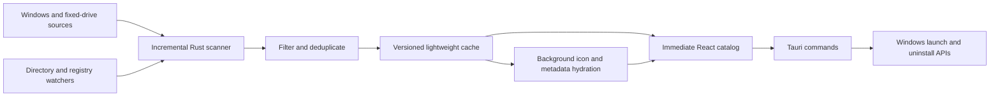

# Windows Apps Technical Documentation

> Technical and release reference for Windows Apps 0.1.0.

[Back to README](README.md) · [Latest release](../../releases/latest) · [Telegram](https://t.me/keskiyo)

---

## 1. Product scope

Windows Apps is a local catalog, launcher, and organization layer for software installed on Windows. It combines Windows discovery sources, Steam manifests, and portable executable discovery across permanent local drives, removes maintenance noise, merges duplicate records, and exposes source-aware launch and uninstall operations through a responsive React interface.

The project intentionally does not provide cloud synchronization, telemetry, online metadata enrichment, automatic updates, or silent file deletion.

## 2. Supported environment

| Component           | Supported environment                                              |
| ------------------- | ------------------------------------------------------------------ |
| Operating system    | Windows 10 and Windows 11                                          |
| CPU architecture    | x64                                                                |
| Application runtime | Tauri 2 with Microsoft Edge WebView2                               |
| Frontend            | React 18, TypeScript, Vite, Tailwind CSS                           |
| Native backend      | Rust 2021 and Windows APIs                                         |
| Package format      | NSIS `.exe`; MSI may also be produced by the local Tauri toolchain |

The installer uses Tauri's WebView2 download bootstrapper when WebView2 is not already present.

## 3. Architecture



The frontend owns presentation and user preferences. Rust owns system discovery, cache persistence, icon extraction, metadata access, source-aware launching, safe uninstall routing, autostart, tray lifecycle, and global shortcut registration.

The main Tauri commands are:

| Command                   | Responsibility                                                                                                             |
| ------------------------- | -------------------------------------------------------------------------------------------------------------------------- |
| `get_apps`                | Return the sanitized cached catalog immediately.                                                                           |
| `refresh_apps`            | Validate changed sources and directories, persist a delta, then hydrate details in background.                             |
| `force_full_scan`         | Rebuild the complete source catalog and portable filesystem index after user confirmation.                                 |
| `reset_catalog_cache`     | Remove generated catalog and icon cache files, preserve user preferences, then force a clean scan.                         |
| `hydrate_visible_icons`   | Start icon and metadata hydration with the currently visible application IDs first.                                        |
| `start_background_sync`   | Start non-blocking incremental validation after a cached catalog is displayed.                                             |
| `launch_app`              | Launch an application using its recorded source type.                                                                      |
| `get_uninstall_preview`   | Return publisher, source, removal method, and exact command for the selected uninstall route.                              |
| `uninstall_app`           | Run the concrete uninstall mechanism registered by Windows, record a privacy-limited result, and return completion status. |
| `get_uninstall_history`   | Read the local bounded uninstall history newest-first.                                                                     |
| `clear_uninstall_history` | Clear the local uninstall history without changing the catalog.                                                            |
| `get_system_settings`     | Return version, autostart state, and global shortcut status.                                                               |
| `set_autostart`           | Enable or disable startup for the current Windows account.                                                                 |
| `open_telegram`           | Open the fixed project contact link.                                                                                       |

## 4. Catalog discovery pipeline

### Sources

The scanner combines records from:

- user and system Start Menu shortcuts;
- registered desktop applications;
- Windows Start Apps;
- Store/MSIX application packages;
- Steam libraries declared by `libraryfolders.vdf` and installed app manifests;
- portable executables discovered on drives reported by Windows as `DRIVE_FIXED`.

Removable, optical, and network drives are never included in automatic scanning. Drive letters and user folder names are not hardcoded.

### Lifecycle

1. Startup reads a versioned lightweight catalog from the Tauri application data directory and renders names immediately.
2. When no cache exists, the interface asks before the first complete scan.
3. With a cache present, background synchronization validates Windows sources, Steam manifests, and the fixed-drive directory index without blocking startup.
4. Unchanged portable directories reuse indexed records; changed directories alone are enumerated and inspected. Refresh uses the same incremental path.
5. **Settings > Catalog maintenance > Force full scan** discards incremental assumptions for one pass and rebuilds the directory index.
6. System directories, caches, dependency trees, Steam libraries, maintenance tools, configured exclusions, removable drives, and network drives are skipped.
7. Catalog changes are emitted as generation-tagged deltas. The frontend ignores stale generations and preserves local organization preferences.
8. Icons are stored separately from the catalog using source fingerprints. The UI can ask Rust to hydrate the currently visible cards first, then the normal background hydrator continues through the remaining catalog in bounded batches.
9. While the process is running, debounced directory and registry watchers request synchronization for Start Menu, uninstall registry, Steam, and Included-folder changes.

Arbitrary locations on permanent fixed drives are intentionally not watched continuously. Their changes are detected during startup validation or Refresh, which avoids keeping a recursive watcher on every directory of every disk.

## 5. Deduplication and source priority

Sanitization considers normalized display names, case-insensitive paths, resolved shortcut targets, package identities, publishers, architecture/version suffixes, and cached stable IDs.

Important rules include:

- prefer a valid `.lnk` shortcut over a matching executable record;
- keep the executable when no useful shortcut exists;
- merge packaged and desktop records only when identity evidence is strong;
- merge known architecture or version suffix duplicates without merging unrelated products that merely share a prefix;
- preserve records with conflicting publishers;
- remove installers, uninstallers, maintenance tools, resource-only names, invalid Unicode output, and stale noise;
- prefer the newer version when duplicate portable copies expose the same product identity;
- prefer Steam launch identities for Steam-managed games while merging local registry metadata when available.

Deduplication is intentionally conservative: preserving two uncertain records is safer than hiding a legitimate application.

## 6. Icons and metadata

Icons are extracted from shortcut icon locations, resolved executable targets, package assets, and Windows shell resources. The lightweight catalog never embeds large icon payloads. A separate fingerprinted icon cache supplies reusable icons before slower metadata hydration completes.

The information dialog can display:

- description;
- version;
- publisher;
- category and source;
- launch target;
- install location;
- uninstall availability.

Values originate from local Windows, package, shortcut, registry, or executable resources. Unavailable fields remain `Unknown`. Windows Apps does not search the internet or generate descriptions.

## 7. Categories and local preferences

Built-in categories provide the initial organization. A category row has two deliberate pointer behaviors: click its name to open the category, or drag the same row to change its position. No separate drag icon is required. Users can also rename labels, create custom categories, collapse sections, and move individual applications. Deleting a custom category moves its applications to **Other**.

The built-in **Windows Features** category groups confirmed Windows components such as File Explorer, Snipping Tool, Task Scheduler, Get Help, Remote Desktop Connection, Windows administrative consoles, accessibility tools, and inbox applications. Classification uses known display names, executable targets, and package identifiers. A generic `Microsoft` name is intentionally insufficient, so products such as Microsoft Edge, Visual Studio, Microsoft 365, Xbox, and Game Bar retain their functional categories.

The following preferences remain local:

- favorite application IDs;
- hidden application IDs;
- custom categories and labels;
- category order and collapsed state;
- manual application-to-category assignments;
- automatic fixed-drive scanning and custom included/excluded paths.

Settings lists every detected permanent local drive. Additional folders and exclusions must resolve to a fixed local drive; USB and network paths are rejected.

Hidden applications appear only in the **Hidden** navigation view. Restoring an item preserves its previous category and favorite state. Hiding never uninstalls or modifies the target application.

## 8. Launching and uninstalling

### Launching

Windows Apps records the source kind for every item and selects the matching Windows launch path for shortcuts, executables, shell targets, and packaged applications.

### Uninstalling

The uninstall flow follows this priority:

1. registered quiet vendor uninstall command;
2. registered standard vendor/MSI uninstall command;
3. valid MSIX package uninstall route.

Before execution, the confirmation dialog displays the publisher, catalog source, removal method, and exact command that Rust will start. If preview loading fails, confirmation stays disabled.

If Windows exposes no concrete safe uninstall target, the menu displays a disabled **Uninstall unavailable** item. The application waits for a directly registered process, reports a non-success exit code, and refreshes the catalog after successful completion. It never treats shortcut deletion or recursive folder deletion as an uninstall operation.

Every started uninstall attempt appends a local history entry with app name, publisher, method, result, and Unix timestamp. The history retains the newest 100 entries and deliberately excludes command text, paths, arguments, package identifiers, errors, and usernames. The Settings page can clear this history.

## 9. Native Windows integrations

### Global shortcut

`Win+Shift+Q` is registered with `RegisterHotKey` and physical virtual key `VK_Q`. The same physical key therefore works with English Q and Russian Й layouts. If another process owns the combination, Settings reports the conflict while the rest of the application remains available.

### Background and system tray

Closing the main window prevents process termination and hides the window in the Windows notification area. The shortcut, a left click on the tray icon, or **Open Windows Apps** restores and focuses it. Tray **Quit** marks the exit as intentional, terminates the process, and releases the shortcut.

### Startup with Windows

The Settings toggle writes the quoted path of the currently running executable to:

```text
HKCU\Software\Microsoft\Windows\CurrentVersion\Run
```

The entry affects only the current account. Moving the executable after enabling startup requires toggling the setting off and on again.

### WebView2

The interface runs inside Microsoft Edge WebView2. Production bundles use Tauri's silent download bootstrapper when the runtime is missing.

## 10. Privacy and security

### Local data boundary

- The catalog and preferences are stored locally.
- No application inventory is uploaded.
- Uninstall history is local, bounded to 100 entries, and excludes command text, paths, arguments, package identifiers, errors, and usernames.
- No telemetry service is configured.
- Metadata is not enriched over the network.
- The CSP restricts content to the application and Tauri IPC endpoints.

### Destructive operations

- Uninstalling requires an explicit confirmation dialog with the command, publisher, source, and removal method shown before execution.
- Native code invokes registered uninstall mechanisms instead of deleting program files.
- Removing a category or hiding an item affects only local catalog preferences.

### Code signing

Version 0.1.0 does not include a configured Authenticode signing identity. An unsigned installer can trigger Microsoft Defender SmartScreen. Publish SHA-256 checksums with every release and never describe an unsigned artifact as signed.

## 11. Repository structure

```text
public/                         Static assets and application logo
src/components/apps/            Application cards and action menus
src/components/catalog/         Catalog grids and category sections
src/components/dialogs/         Information, deletion, and uninstall dialogs
src/components/navigation/      Sidebar, drawer, and sortable category navigation
src/components/settings/        Settings interface
src/components/shared/          Shared interface components
src/hooks/                      Reusable navigation and interaction hooks
src/lib/                        Tauri clients, preferences, and catalog helpers
src/store/                      Zustand application state
src/tests/                      Frontend tests grouped by feature
src/types/                      Shared TypeScript contracts
src-tauri/src/catalog/          Discovery, cache, registry, and Start Apps logic
src-tauri/src/lifecycle/        Window, tray, and process lifecycle
src-tauri/src/platform/windows/ Windows integrations and native operations
src-tauri/capabilities/         Tauri security capabilities
```

Important native modules include `catalog`, `cache`, `incremental`, `sync`, `hydration`, `icon_cache`, `change_watcher`, `registry`, `start_apps`, `icon_extractor`, `launcher`, `uninstaller`, `autostart`, `global_shortcut`, and `lifecycle`.

Portable and game discovery are isolated in `catalog/portable.rs` and `catalog/steam.rs`; fixed-drive enumeration is isolated in `platform/windows/drives.rs`.

## 12. Development workflow

### Prerequisites

- Node.js and npm;
- stable Rust with the `x86_64-pc-windows-msvc` toolchain;
- Microsoft C++ Build Tools and Windows SDK;
- WebView2 Runtime;
- the official [Tauri prerequisites for Windows](https://v2.tauri.app/start/prerequisites/).

### Start development

```powershell
npm install
npm run tauri dev
```

Vite provides frontend hot reload. Native Rust changes trigger a Tauri rebuild.

### Verification

```powershell
npm test
npm run build
cargo test --manifest-path src-tauri/Cargo.toml
cargo check --manifest-path src-tauri/Cargo.toml
```

## 13. Production build

Confirm that the application version matches in:

- `package.json`;
- `src-tauri/Cargo.toml`;
- `src-tauri/tauri.conf.json`.

Build production bundles on Windows x64:

```powershell
npm run tauri build
```

Expected artifact directories:

```text
src-tauri/target/release/bundle/nsis/Windows Apps_0.1.0_x64-setup.exe
src-tauri/target/release/bundle/msi/Windows Apps_0.1.0_x64_en-US.msi
```

Use the NSIS `-setup.exe` as the primary public download. The MSI is optional.

Generate the release checksum:

```powershell
$installer = Get-ChildItem src-tauri/target/release/bundle/nsis -Filter *.exe |
  Sort-Object LastWriteTime -Descending |
  Select-Object -First 1

Get-FileHash $installer.FullName -Algorithm SHA256
```

## 14. Publishing a GitHub Release

The repository includes a tag-driven GitHub Actions workflow at `.github/workflows/release.yml`.

1. Run local verification and clean-machine checks.
2. Confirm `package.json`, `src-tauri/Cargo.toml`, and `src-tauri/tauri.conf.json` contain the same version.
3. Push a version tag such as `v0.1.0`.
4. GitHub Actions validates the tag against all manifests, runs frontend and Rust tests, builds the NSIS x64 installer, writes SHA-256, and creates the GitHub Release.
5. Review the generated Release notes and attached assets.

The workflow is intentionally tag-only. A tag/version mismatch fails before any Release is published.

### Release notes template

```markdown
# Windows Apps 0.1.0

## Highlights

- Unified and deduplicated Windows application catalog.
- Steam and portable application discovery across permanent local drives.
- Custom categories with direct row dragging, Favorites, and reversible Hidden items.
- System tray lifecycle and global Win+Shift+Q shortcut.

## Requirements

- Windows 10 or Windows 11 x64.
- WebView2 Runtime; the installer can bootstrap it when missing.

## Installation

Download the x64 setup executable, verify its SHA-256 checksum, and run it.

## Verification

SHA-256: `<paste the published checksum>`

## Known limitations

- The 0.1.0 installer is not Authenticode-signed and may trigger SmartScreen.
- Online metadata enrichment and automatic updates are not included.
```

Do not publish a tag or Release until clean-machine verification is complete.

## 15. Troubleshooting

### The catalog is empty

Press **Scan for apps**. The first launch intentionally waits for user confirmation before performing a full scan. If an existing catalog appears stale after Refresh, run **Settings > Catalog maintenance > Force full scan** once to rebuild its index.

### Duplicate or stale entries remain after Refresh

Use **Settings > Catalog maintenance > Reset catalog cache**. This removes generated catalog and icon cache files, keeps favorites, Hidden items, custom categories, and category overrides, then performs a clean full scan.

### An icon is missing

Wait for background icon hydration, then scan again if the application or shortcut changed. Some Windows shell entries do not expose an extractable icon.

### `Win+Shift+Q` does not restore the window

Confirm that Windows Apps is running in the notification area and review the shortcut status in Settings. Another application may already own the combination.

### Startup does not launch the application

Check the Settings toggle and Windows **Startup apps** settings. If the executable moved, disable and re-enable startup to refresh the registered path.

### The installer displays SmartScreen

Confirm that the file came from this repository's Releases page and compare its SHA-256 value with the published checksum. This warning is expected for an unsigned 0.1.0 community build.

### Duplicate or maintenance entries remain

Run a fresh scan or reset the catalog cache. If the entry remains, record its displayed name, source, launch target, publisher, and resolved path before reporting it.

### A portable application is missing

Confirm that the executable is on a permanent local drive and is not inside a configured exclusion. Add its containing directory under **Settings > Application discovery** when automatic fixed-drive scanning is disabled. Executables without usable product metadata are included when their filename and parent directory identify the same product, or when the file is a known standalone portable utility such as Rufus. Helper, updater, crash reporter, installer, and documentation executables are filtered to avoid flooding the catalog.

## 16. Release verification checklist

### Automated

- [ ] Frontend tests pass.
- [ ] Category rows open on click and reorder when dragged by their name.
- [ ] Steam manifests and portable executables are discovered on fixed drives.
- [ ] USB and network drives are excluded.
- [ ] Scan progress, cancellation, include paths, and exclude paths work.
- [ ] TypeScript and Vite production build pass.
- [ ] Rust tests pass.
- [ ] Cargo check passes.
- [ ] Tauri production bundle completes.
- [ ] SHA-256 checksum is generated for the uploaded `.exe`.

### Windows 10 x64

- [ ] Installer completes and the application starts.
- [ ] WebView2 bootstrap works when required.
- [ ] Scan, cache, launch, direct uninstall, and the disabled unavailable state work.
- [ ] Favorites, custom categories, and Hidden restore persist.
- [ ] Close-to-tray, tray Open/Quit, shortcut, and autostart work.

### Windows 11 x64

- [ ] Installer completes and the application starts.
- [ ] WebView2 bootstrap works when required.
- [ ] Scan, cache, launch, direct uninstall, and the disabled unavailable state work.
- [ ] Favorites, custom categories, and Hidden restore persist.
- [ ] Close-to-tray, tray Open/Quit, shortcut, and autostart work.

---

[Back to README](README.md) · [Latest release](../../releases/latest) · [Telegram: @keskiyo](https://t.me/keskiyo)
