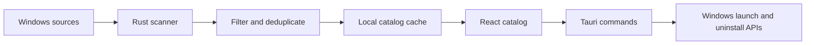

# Windows Apps Technical Documentation

> Technical and release reference for Windows Apps 0.1.0.

[Back to README](README.md) · [Latest release](../../releases/latest) · [Telegram](https://t.me/keskiyo)

---

## 1. Product scope

Windows Apps is a local catalog, launcher, and organization layer for software installed on Windows. It combines several Windows discovery sources, removes maintenance noise, merges duplicate records, and exposes source-aware launch and uninstall operations through a responsive React interface.

The project intentionally does not provide cloud synchronization, telemetry, online metadata enrichment, automatic updates, or silent file deletion.

## 2. Supported environment

| Component           | Supported environment                                              |
| ------------------- | ------------------------------------------------------------------ |
| Operating system    | Windows 10 and Windows 11                                          |
| CPU architecture    | x64                                                                |
| Application runtime | Tauri 2 with Microsoft Edge WebView2                               |
| Frontend            | React 18, TypeScript, Vite, Tailwind CSS                           |
| Native backend      | Rust 2021 and Windows APIs                                         |
| Package format      | NSIS `.exe`; MSI may also be produced by the local Tauri toolchain |

The installer uses Tauri's WebView2 download bootstrapper when WebView2 is not already present.

## 3. Architecture



The frontend owns presentation and user preferences. Rust owns system discovery, cache persistence, icon extraction, metadata access, source-aware launching, safe uninstall routing, autostart, tray lifecycle, and global shortcut registration.

The main Tauri commands are:

| Command               | Responsibility                                                                               |
| --------------------- | -------------------------------------------------------------------------------------------- |
| `get_apps`            | Return the sanitized cached catalog immediately.                                             |
| `refresh_apps`        | Perform a requested scan, persist the result, then hydrate missing icons in the background.  |
| `launch_app`          | Launch an application using its recorded source type.                                        |
| `uninstall_app`       | Run the concrete uninstall mechanism registered by Windows and return its completion status. |
| `get_system_settings` | Return version, autostart state, and global shortcut status.                                 |
| `set_autostart`       | Enable or disable startup for the current Windows account.                                   |
| `open_telegram`       | Open the fixed project contact link.                                                         |

## 4. Catalog discovery pipeline

### Sources

The scanner combines records from:

- user and system Start Menu shortcuts;
- registered desktop applications;
- Windows Start Apps;
- Store/MSIX application packages.

### Lifecycle

1. Startup reads the last sanitized catalog from the Tauri application data directory.
2. No full scan runs automatically when a cache is unavailable; the interface asks the user first.
3. **Scan for apps** starts native discovery on a background task.
4. The result is sanitized, sorted, written to the local cache, and returned to the interface.
5. Existing cached icons are reused immediately.
6. Missing icons are hydrated asynchronously and delivered through the `apps://updated` event.

This design keeps normal startup fast while preserving a deliberate refresh path.

## 5. Deduplication and source priority

Sanitization considers normalized display names, case-insensitive paths, resolved shortcut targets, package identities, publishers, architecture/version suffixes, and cached stable IDs.

Important rules include:

- prefer a valid `.lnk` shortcut over a matching executable record;
- keep the executable when no useful shortcut exists;
- merge packaged and desktop records only when identity evidence is strong;
- merge known architecture or version suffix duplicates without merging unrelated products that merely share a prefix;
- preserve records with conflicting publishers;
- remove installers, uninstallers, maintenance tools, resource-only names, invalid Unicode output, and stale noise.

Deduplication is intentionally conservative: preserving two uncertain records is safer than hiding a legitimate application.

## 6. Icons and metadata

Icons are extracted from shortcut icon locations, resolved executable targets, package assets, and Windows shell resources. Cached icons are reused by stable application ID before slower hydration begins.

The information dialog can display:

- description;
- version;
- publisher;
- category and source;
- launch target;
- install location;
- uninstall availability.

Values originate from local Windows, package, shortcut, registry, or executable resources. Unavailable fields remain `Unknown`. Windows Apps does not search the internet or generate descriptions.

## 7. Categories and local preferences

Built-in categories provide the initial organization. Users can reorder categories, rename labels, create custom categories, collapse sections, and move individual applications. Deleting a custom category moves its applications to **Other**.

The following preferences remain local:

- favorite application IDs;
- hidden application IDs;
- custom categories and labels;
- category order and collapsed state;
- manual application-to-category assignments.

Hidden applications appear only in the **Hidden** navigation view. Restoring an item preserves its previous category and favorite state. Hiding never uninstalls or modifies the target application.

## 8. Launching and uninstalling

### Launching

Windows Apps records the source kind for every item and selects the matching Windows launch path for shortcuts, executables, shell targets, and packaged applications.

### Uninstalling

The uninstall flow follows this priority:

1. registered quiet vendor uninstall command;
2. registered standard vendor/MSI uninstall command;
3. valid MSIX package uninstall route.

If Windows exposes no concrete safe uninstall target, the menu displays **Uninstall unavailable** and does not redirect elsewhere. The application waits for the registered process, reports a non-success exit code, and refreshes the catalog after successful completion. It never treats shortcut deletion or recursive folder deletion as an uninstall operation.

## 9. Native Windows integrations

### Global shortcut

`Win+Shift+Q` is registered with `RegisterHotKey` and physical virtual key `VK_Q`. The same physical key therefore works with English Q and Russian Й layouts. If another process owns the combination, Settings reports the conflict while the rest of the application remains available.

### Background and system tray

Closing the main window prevents process termination and hides the window in the Windows notification area. The shortcut, a left click on the tray icon, or **Open Windows Apps** restores and focuses it. Tray **Quit** marks the exit as intentional, terminates the process, and releases the shortcut.

### Startup with Windows

The Settings toggle writes the quoted path of the currently running executable to:

```text
HKCU\Software\Microsoft\Windows\CurrentVersion\Run
```

The entry affects only the current account. Moving the executable after enabling startup requires toggling the setting off and on again.

### WebView2

The interface runs inside Microsoft Edge WebView2. Production bundles use Tauri's silent download bootstrapper when the runtime is missing.

## 10. Privacy and security

### Local data boundary

- The catalog and preferences are stored locally.
- No application inventory is uploaded.
- No telemetry service is configured.
- Metadata is not enriched over the network.
- The CSP restricts content to the application and Tauri IPC endpoints.

### Destructive operations

- Uninstalling requires an explicit confirmation dialog.
- Native code invokes registered uninstall mechanisms instead of deleting program files.
- Removing a category or hiding an item affects only local catalog preferences.

### Code signing

Version 0.1.0 does not include a configured Authenticode signing identity. An unsigned installer can trigger Microsoft Defender SmartScreen. Publish SHA-256 checksums with every release and never describe an unsigned artifact as signed.

## 11. Repository structure

```text
public/                  Static assets and application logo
src/components/          Focused React UI components
src/hooks/               Reusable navigation and interaction hooks
src/lib/                 Tauri clients, preferences, and catalog helpers
src/store/               Zustand application state
src/types/               Shared TypeScript contracts
src-tauri/src/           Rust discovery and native Windows integrations
src-tauri/capabilities/  Tauri security capabilities
```

Important native modules include `apps_scanner`, `cache`, `icon_extractor`, `launcher`, `uninstaller`, `autostart`, `global_shortcut`, and `app_lifecycle`.

## 12. Development workflow

### Prerequisites

- Node.js and npm;
- stable Rust with the `x86_64-pc-windows-msvc` toolchain;
- Microsoft C++ Build Tools and Windows SDK;
- WebView2 Runtime;
- the official [Tauri prerequisites for Windows](https://v2.tauri.app/start/prerequisites/).

### Start development

```powershell
npm install
npm run tauri dev
```

Vite provides frontend hot reload. Native Rust changes trigger a Tauri rebuild.

### Verification

```powershell
npm test
npm run build
cargo test --manifest-path src-tauri/Cargo.toml
cargo check --manifest-path src-tauri/Cargo.toml
```

## 13. Production build

Confirm that the application version matches in:

- `package.json`;
- `src-tauri/Cargo.toml`;
- `src-tauri/tauri.conf.json`.

Build production bundles on Windows x64:

```powershell
npm run tauri build
```

Expected artifact directories:

```text
src-tauri/target/release/bundle/nsis/   Windows x64 setup executable
src-tauri/target/release/bundle/msi/    Optional Windows Installer package
```

Generate the release checksum:

```powershell
$installer = Get-ChildItem src-tauri/target/release/bundle/nsis -Filter *.exe |
  Sort-Object LastWriteTime -Descending |
  Select-Object -First 1

Get-FileHash $installer.FullName -Algorithm SHA256
```

## 14. Publishing a GitHub Release

1. Run the complete frontend and Rust verification suite.
2. Build the production bundles with `npm run tauri build`.
3. Install the generated setup executable on clean Windows 10 x64 and Windows 11 x64 systems.
4. Verify initial launch, scan, cache restart, app launch, category persistence, Hidden restore, favorites, tray lifecycle, `Win+Shift+Q`, autostart, direct uninstall, and unavailable uninstall state.
5. Generate SHA-256 checksums for every uploaded artifact.
6. Create an annotated version tag such as `v0.1.0`.
7. Create a GitHub Release from that tag.
8. Upload the NSIS `-setup.exe`, optional MSI, and checksum text.
9. Publish release notes using the template below.

### Release notes template

```markdown
# Windows Apps 0.1.0

## Highlights

- Unified and deduplicated Windows application catalog.
- Custom categories, Favorites, and reversible Hidden items.
- System tray lifecycle and global Win+Shift+Q shortcut.

## Requirements

- Windows 10 or Windows 11 x64.
- WebView2 Runtime; the installer can bootstrap it when missing.

## Installation

Download the x64 setup executable, verify its SHA-256 checksum, and run it.

## Verification

SHA-256: `<paste the published checksum>`

## Known limitations

- The 0.1.0 installer is not Authenticode-signed and may trigger SmartScreen.
- Online metadata enrichment and automatic updates are not included.
```

Do not publish a tag or Release until clean-machine verification is complete.

## 15. Troubleshooting

### The catalog is empty

Press **Scan for apps**. The first launch intentionally waits for user confirmation before performing a full scan.

### An icon is missing

Wait for background icon hydration, then scan again if the application or shortcut changed. Some Windows shell entries do not expose an extractable icon.

### `Win+Shift+Q` does not restore the window

Confirm that Windows Apps is running in the notification area and review the shortcut status in Settings. Another application may already own the combination.

### Startup does not launch the application

Check the Settings toggle and Windows **Startup apps** settings. If the executable moved, disable and re-enable startup to refresh the registered path.

### The installer displays SmartScreen

Confirm that the file came from this repository's Releases page and compare its SHA-256 value with the published checksum. This warning is expected for an unsigned 0.1.0 community build.

### Duplicate or maintenance entries remain

Run a fresh scan. If the entry remains, record its displayed name, source, launch target, publisher, and resolved path before reporting it.

## 16. Release verification checklist

### Automated

- [ ] Frontend tests pass.
- [ ] TypeScript and Vite production build pass.
- [ ] Rust tests pass.
- [ ] Cargo check passes.
- [ ] Tauri production bundle completes.
- [ ] SHA-256 checksum is generated for the uploaded `.exe`.

### Windows 10 x64

- [ ] Installer completes and the application starts.
- [ ] WebView2 bootstrap works when required.
- [ ] Scan, cache, launch, direct uninstall, and unavailable uninstall state work.
- [ ] Favorites, custom categories, and Hidden restore persist.
- [ ] Close-to-tray, tray Open/Quit, shortcut, and autostart work.

### Windows 11 x64

- [ ] Installer completes and the application starts.
- [ ] WebView2 bootstrap works when required.
- [ ] Scan, cache, launch, direct uninstall, and unavailable uninstall state work.
- [ ] Favorites, custom categories, and Hidden restore persist.
- [ ] Close-to-tray, tray Open/Quit, shortcut, and autostart work.

---

[Back to README](README.md) · [Latest release](../../releases/latest) · [Telegram: @keskiyo](https://t.me/keskiyo)
