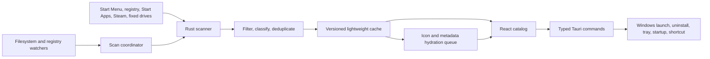

# Windows Apps Technical Documentation

Technical reference for Windows Apps `0.2.0`.

[README](README.md) ·
[Release 0.2.0](https://github.com/keskiyo/WindowsApps/releases/tag/v0.2.0) ·
[Telegram](https://t.me/keskiyo)

---

## 1. Product scope

Windows Apps is a local Windows application catalog, launcher, and organization layer. It discovers applications from Windows and local-drive sources, sanitizes and deduplicates the results, stores a lightweight cache, and exposes native launch and registered-uninstall operations through a React interface.

The supported product scope does not include:

- cloud synchronization;
- telemetry or software-inventory uploads;
- online metadata enrichment;
- arbitrary command execution from the frontend;
- automatic application updates;
- VPN control;
- direct deletion of program directories.

## 2. Supported environment

| Component        | Current implementation                       |
| ---------------- | -------------------------------------------- |
| Operating system | Windows 10 and Windows 11                    |
| CPU architecture | x64                                          |
| Desktop runtime  | Tauri 2 and Microsoft Edge WebView2          |
| Frontend         | React 18, TypeScript, Vite 6, Tailwind CSS 4 |
| Native backend   | Rust 2021 and Windows APIs                   |
| State            | Zustand plus local component state           |
| Tests            | Vitest/Testing Library and Rust unit tests   |
| Primary package  | NSIS setup executable                        |

The main window uses custom decorations, supports resizing, and has a minimum size of `760 × 520`.

## 3. Architecture



### Ownership boundaries

The React frontend owns:

- presentation and responsive navigation;
- search and current view state;
- Favorites, Hidden items, custom categories, and manual category assignments;
- dialogs, confirmations, scan progress, and user feedback.

The Rust backend owns:

- discovery and portable scanning;
- cache persistence and incremental indexes;
- icon and executable metadata extraction;
- deduplication inputs and source-aware launch targets;
- uninstall target resolution and execution;
- global shortcut, autostart, tray, and window lifecycle;
- filesystem and registry watchers.

The frontend sends application IDs for native actions. Rust resolves those IDs through trusted maps built from the catalog, so the webview cannot supply an arbitrary executable path.

## 4. Tauri command surface

| Command                   | Responsibility                                                               |
| ------------------------- | ---------------------------------------------------------------------------- |
| `get_apps`                | Return the sanitized cached catalog, cache status, and generation.           |
| `refresh_apps`            | Run an interactive incremental refresh.                                      |
| `force_full_scan`         | Rebuild configured sources without relying on the previous filesystem index. |
| `reset_catalog_cache`     | Remove generated catalog and icon caches, then run a clean full scan.        |
| `hydrate_visible_icons`   | Promote visible application IDs in the hydration queue.                      |
| `start_background_sync`   | Start background validation after the cached catalog is displayed.           |
| `cancel_scan`             | Cancel active and queued scanning work.                                      |
| `launch_app`              | Launch a trusted catalog entry by ID.                                        |
| `get_uninstall_preview`   | Return publisher, source, removal mechanism, and command.                    |
| `uninstall_app`           | Execute the trusted uninstall target and record its result.                  |
| `get_uninstall_history`   | Return the local uninstall history newest-first.                             |
| `clear_uninstall_history` | Delete uninstall history without modifying applications.                     |
| `get_system_settings`     | Return version, autostart, shortcut, scan settings, and fixed drives.        |
| `set_autostart`           | Enable or disable startup for the current Windows account.                   |
| `set_scan_settings`       | Save automatic fixed-drive, included-path, and excluded-path settings.       |
| `open_telegram`           | Open the fixed project contact URL.                                          |

## 5. Catalog discovery

### Sources

The catalog combines:

- per-user and system Start Menu shortcuts;
- uninstall registry entries for 64-bit, 32-bit, and current-user software;
- Windows Start Apps and packaged applications;
- Steam library folders and app manifests;
- portable executables discovered on fixed local drives;
- user-configured included folders.

Drive letters and user folder names are not hardcoded.

### Exclusions

Automatic portable discovery excludes:

- removable USB drives;
- network and optical drives;
- junctions, symbolic links, and other reparse-point directories;
- configured excluded paths;
- dependency, cache, system, and maintenance locations;
- installers, uninstallers, updaters, crash reporters, helper binaries, and documentation shortcuts.

### Scan limits

Default limits for each portable scan root:

| Limit            | Value          |
| ---------------- | -------------- |
| Maximum depth    | 16 directories |
| Maximum entries  | 500,000        |
| Maximum duration | 3 minutes      |

If an entry or time limit is reached, discovered results are retained but the partial directory is not recorded as fully indexed. A later scan can inspect it again.

## 6. Startup, incremental scanning, and watchers

1. `get_apps` reads the versioned cache and renders application names immediately.
2. A missing cache produces the first-scan prompt instead of silently scanning all drives.
3. Cached applications enter a background hydration queue for icons and local metadata.
4. `start_background_sync` checks Windows sources and indexed fixed-drive directories without blocking startup.
5. Unchanged directories reuse cached application records.
6. Changed directories are re-enumerated and their additions/removals are merged into a new catalog generation.
7. Watcher-triggered scans emit deltas instead of replacing the entire frontend list.
8. Interactive Refresh and Force full scan return a complete list and expose progress.

One scan coordinator serializes Startup, Watch, Refresh, and Force work:

- repeated watcher events are coalesced;
- interactive work cancels lower-priority background work;
- cancelled results are not written to the cache;
- only one scan mutates the catalog at a time.

The watcher monitors Start Menu paths, uninstall registry keys, and user-configured included folders. Arbitrary fixed-drive roots are validated during startup or Refresh instead of being watched recursively.

## 7. Cache and asynchronous hydration

The catalog cache contains lightweight application records and a monotonically increasing generation. Large icon payloads are stored separately.

Icon hydration:

- deduplicates requests by application ID and catalog generation;
- promotes currently visible cards;
- processes only changed applications after watcher scans;
- emits patches in batches of 24 to avoid a full React update for every icon;
- uses source fingerprints to reuse valid cached PNG data;
- discards stale work after a new generation starts.

Reset catalog cache removes generated catalog/index and icon cache files. It does not remove Favorites, Hidden entries, custom categories, category ordering, or manual assignments.

## 8. Filtering and duplicate resolution

Duplicate matching considers:

- case-insensitive paths;
- resolved shortcut targets;
- normalized product families;
- architecture suffixes such as `x64`, `x86`, `64-bit`, and `32-bit`;
- version suffixes;
- shortcut/executable pairs in the same product folder;
- package and desktop identity;
- publishers when both are available.

Candidate priority is:

1. Steam identity;
2. `.lnk` shortcut;
3. `.exe` executable;
4. packaged application identity.

Metadata and uninstall data from the secondary record are merged into the preferred record when safe. Conflicting publishers and products that merely share a prefix remain separate. Deduplication intentionally prefers a possible duplicate over hiding a legitimate application when identity evidence is weak.

## 9. Categories and navigation

Built-in categories:

- Games;
- AI & Agents;
- Editors & Design;
- Development;
- Browsers;
- Media;
- Communication;
- Utilities;
- System;
- Windows Features;
- Other.

Windows Features is based on known names, targets, and package identities. A generic Microsoft publisher/name is not enough to classify an application as a Windows component.

Users can:

- create, rename, delete, and reorder categories;
- drag a category by its name;
- click the same category row to navigate to it;
- move applications between categories;
- mark applications as Favorites;
- hide and later restore applications.

Deleting a custom category moves its applications to Other. Hidden is a separate navigation view and does not uninstall or modify the application.

At widths of `1024px` and above, navigation uses a persistent sidebar. Below `1024px`, the same navigation is presented as an overlay drawer.

## 10. Launching

Launch kinds:

- executable;
- shortcut;
- AppUserModelID / packaged application;
- Steam-managed application identity.

The backend stores each trusted launch kind and target against its stable application ID. `launch_app` accepts only that ID and resolves the actual target inside Rust.

## 11. Uninstalling

Supported uninstall targets:

1. registered quiet vendor command when available;
2. registered standard vendor or MSI command;
3. valid MSIX package removal.

Before confirmation, the UI requests an uninstall preview containing:

- application name;
- publisher;
- catalog source;
- removal mechanism;
- exact command.

If Rust cannot resolve a concrete safe target, the action remains disabled as **Uninstall unavailable**.

Safety rules:

- UNC/network-hosted uninstall executables are rejected;
- empty or malformed registered commands are rejected;
- program directories are not deleted directly;
- deleting a shortcut is not treated as uninstalling software;
- the frontend cannot substitute a command or target path.

The history stores only:

- timestamp;
- application name;
- publisher;
- removal mechanism;
- succeeded/failed result.

It retains the newest 100 records and excludes command text, paths, arguments, package IDs, usernames, and detailed errors.

## 12. Native Windows integrations

### System tray

Closing the main window hides it instead of terminating the process. The tray icon can restore the window. **Quit** performs an intentional process exit.

### Global shortcut

`Win+Shift+Q` is registered with `RegisterHotKey` and physical `VK_Q`. It therefore refers to the same keyboard key when the active layout changes.

If another process owns the combination, the application remains usable and Settings reports the registration error.

### Startup

The startup toggle writes the quoted current executable path to:

```text
HKCU\Software\Microsoft\Windows\CurrentVersion\Run
```

The setting applies only to the current Windows account.

### WebView2

Production bundles use Tauri's silent WebView2 download bootstrapper when the runtime is missing.

## 13. Privacy and security

- Catalog discovery and categorization are local.
- No external telemetry or catalog upload is configured.
- No online application-description lookup is performed.
- The Content Security Policy allows application resources and Tauri IPC endpoints.
- Native launch and uninstall operations resolve trusted Rust-owned catalog records.
- Uninstall actions require explicit confirmation.
- Scan recursion is bounded and does not follow reparse points.
- Debug logging is enabled only in debug builds.
- The release installer is unsigned and can trigger SmartScreen.

## 14. Repository structure

```text
public/                          Static assets and application icon
src/components/apps/             Application cards and action menus
src/components/catalog/          Catalog grids and sortable sections
src/components/dialogs/          App information and destructive confirmations
src/components/navigation/       Sidebar, drawer, and category navigation
src/components/settings/         Settings and uninstall history
src/components/shared/           Header, title bar, scan prompt, shared UI
src/hooks/                       Navigation, spotlight, and scroll-lock hooks
src/lib/                         Tauri clients, preferences, catalog utilities
src/store/                       Zustand application state
src/tests/                       Frontend tests grouped by layer
src/types/                       Shared TypeScript contracts
src-tauri/src/catalog/           Discovery, cache, scanning, hydration, deduplication
src-tauri/src/lifecycle/         Tray and window lifecycle
src-tauri/src/platform/windows/  Windows-specific native integrations
.github/workflows/release.yml    Tag-driven Windows release pipeline
scripts/verify-release-version.ps1
```

## 15. Development workflow

### Prerequisites

- Node.js 22 and npm;
- stable Rust with `x86_64-pc-windows-msvc`;
- Microsoft C++ Build Tools and Windows SDK;
- WebView2 Runtime;
- [Tauri prerequisites for Windows](https://v2.tauri.app/start/prerequisites/).

### Install and run

```powershell
npm install
npm run tauri dev
```

### Verification

```powershell
npm test
npm run build
cargo test --manifest-path src-tauri/Cargo.toml
cargo check --manifest-path src-tauri/Cargo.toml
```

### Production build

```powershell
npm run tauri build
```

Expected Windows x64 bundles:

```text
src-tauri/target/release/bundle/nsis/Windows Apps_0.2.0_x64-setup.exe
src-tauri/target/release/bundle/msi/Windows Apps_0.2.0_x64_en-US.msi
```

The NSIS setup executable is the primary public artifact.

## 16. Release automation

`.github/workflows/release.yml` runs when a `v*` tag is pushed.

The workflow:

1. checks out the tag;
2. configures Node.js 22 and stable Rust;
3. runs `npm ci`;
4. validates the tag against `package.json`, `src-tauri/Cargo.toml`, and `src-tauri/tauri.conf.json`;
5. runs frontend tests;
6. runs Rust tests;
7. builds Tauri bundles;
8. generates an SHA-256 file for the NSIS installer;
9. creates the GitHub Release and uploads both files.

Prepare a release:

```powershell
npm test
npm run build
cargo test --manifest-path src-tauri/Cargo.toml
cargo check --manifest-path src-tauri/Cargo.toml
npm run tauri build
powershell -NoProfile -File scripts/verify-release-version.ps1 -Tag v0.2.0
```

Publish:

```powershell
git tag -a v0.2.0 -m "Windows Apps 0.2.0"
git push origin v0.2.0
```

Do not reuse or move a tag after a public Release has been published. Increase the version for the next release.

## 17. Troubleshooting

### Catalog is empty

Select **Scan for apps**. The first complete scan requires explicit user action.

### Duplicate or stale entries remain

Run Refresh first. If the saved cache already contains bad records, use **Settings → Catalog maintenance → Reset catalog cache**.

### Application is missing

Confirm that it is on a permanent local drive and not under an excluded folder. Add its folder under **Settings → Application discovery** if needed. Executables without usable metadata may be rejected unless their filename/folder identify a real portable product.

### Icon is missing

Keep the application visible briefly so its ID receives hydration priority. Refresh if its shortcut or executable changed. Some Windows shell entries do not expose an extractable icon.

### Global shortcut does not work

Confirm Windows Apps is still running in the notification area. Check the shortcut status in Settings; another process may already own `Win+Shift+Q`.

### Startup does not work

Disable and enable **Launch when Windows starts** again, especially if the executable was moved after the setting was created.

### Uninstall is unavailable

Windows did not expose a valid registered vendor, MSI, or MSIX uninstall target for that catalog entry. Windows Apps intentionally does not guess a command or delete its directory.

### SmartScreen warning

The installer is not Authenticode-signed. Download it from the project Release and compare its SHA-256 value with the attached checksum.

## 18. Release verification checklist

### Automated checks

- [ ] Frontend tests pass.
- [ ] TypeScript and Vite production build pass.
- [ ] Rust tests pass.
- [ ] Cargo check passes.
- [ ] Version verification passes for the intended tag.
- [ ] Tauri production build completes.
- [ ] NSIS installer and SHA-256 file are attached to the Release.

### Windows 10 x64

- [ ] Installer and WebView2 bootstrap work.
- [ ] First scan, Refresh, Force full scan, cancellation, and cache reset work.
- [ ] Launching works for shortcuts, executables, and packaged apps.
- [ ] Favorites, Hidden items, custom categories, and category ordering persist.
- [ ] Registered uninstall and unavailable states behave correctly.
- [ ] Tray Open/Quit, global shortcut, and autostart work.

### Windows 11 x64

- [ ] Installer and WebView2 bootstrap work.
- [ ] First scan, Refresh, Force full scan, cancellation, and cache reset work.
- [ ] Launching works for shortcuts, executables, and packaged apps.
- [ ] Favorites, Hidden items, custom categories, and category ordering persist.
- [ ] Registered uninstall and unavailable states behave correctly.
- [ ] Tray Open/Quit, global shortcut, and autostart work.

---

[README](README.md) ·
[Release 0.2.0](https://github.com/keskiyo/WindowsApps/releases/tag/v0.2.0) ·
[Telegram: @keskiyo](https://t.me/keskiyo)
