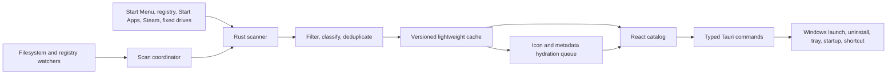

# Windows Apps Technical Documentation

Technical reference for Windows Apps `0.2.8`.

[README](README.md) ·
[Release 0.2.8](https://github.com/keskiyo/WindowsApps/releases/tag/v0.2.8) ·
[Telegram](https://t.me/keskiyo)

---

## 1. Product scope

Windows Apps is a local Windows application catalog, launcher, and organization layer. It discovers applications from Windows and local-drive sources, sanitizes and deduplicates the results, stores a lightweight cache, and exposes native launch and registered-uninstall operations through a React interface.

The supported product scope does not include:

- cloud synchronization;
- telemetry or software-inventory uploads;
- online metadata enrichment;
- arbitrary command execution from the frontend;
- VPN control;
- direct deletion of program directories.

The application updates itself from signed GitHub Releases (see §12). It never
auto-updates the third-party applications it catalogs.

## 2. Supported environment

| Component        | Current implementation                       |
| ---------------- | -------------------------------------------- |
| Operating system | Windows 10 and Windows 11                    |
| CPU architecture | x64                                          |
| Desktop runtime  | Tauri 2 and Microsoft Edge WebView2          |
| Frontend         | React 18, TypeScript, Vite 6, Tailwind CSS 4 |
| Native backend   | Rust 2021 and Windows APIs                   |
| State            | Zustand plus local component state           |
| Tests            | Vitest/Testing Library and Rust unit tests   |
| Package target   | NSIS setup executable                        |

The main window uses custom decorations, supports resizing, and has a minimum size of `560 × 520`. At minimum width, application grids retain two columns and the header keeps navigation, search, and Refresh on one row while hiding the application identity. The catalog summary cards navigate directly to All applications, Favorites, Hidden, and Auxiliary tools.

The header search remains scoped to the currently open view or category. Both it and the `Ctrl+K` quick-launch palette correct queries typed with the Russian/English keyboard layout reversed and allow one insertion, deletion, substitution, or adjacent transposition in name and product-name words of at least four characters. Literal matches rank above corrected and fuzzy matches. The exact one-token queries `cmd` and `сьв` are reserved aliases for the genuine `Microsoft.WindowsTerminal` package and exclude Command Prompt, Git CMD, and internal `OpenConsole.exe` candidates; full queries such as `command prompt` retain normal matching. `Ctrl+P` is reserved and consumed by the application, including when the same physical key reports `Ctrl+З`, so WebView2 never opens its print dialog.

## 3. Architecture


```mermaid
flowchart LR
  Sources["Start Menu, registry, Start Apps, Steam, fixed drives"] --> Scanner["Rust scanner"]
  Watchers["Filesystem and registry watchers"] --> Coordinator["Scan coordinator"]
  Coordinator --> Scanner
  Scanner --> Clean["Filter, classify, deduplicate"]
  Clean --> Cache["Versioned lightweight cache"]
  Cache --> UI["React catalog"]
  Cache --> Hydration["Icon and metadata hydration queue"]
  Hydration --> UI
  UI --> IPC["Typed Tauri commands"]
  IPC --> Native["Windows launch, uninstall, tray, startup, shortcut"]
```

### Ownership boundaries

The React frontend owns:

- presentation and responsive navigation;
- search and current view state;
- Favorites, Hidden items, custom categories, and manual category assignments;
- dialogs, confirmations, scan progress, and user feedback.

The Rust backend owns:

- discovery and portable scanning;
- cache persistence and incremental indexes;
- icon and executable metadata extraction;
- deduplication inputs and source-aware launch targets;
- uninstall target resolution and execution;
- global shortcut, autostart, tray, and window lifecycle;
- filesystem and registry watchers.

The frontend sends application IDs for native actions. Rust resolves those IDs through trusted maps built from the catalog, so the webview cannot supply an arbitrary executable path.
Raw registry access and Windows handles are owned by `src-tauri/src/platform/windows/`; catalog and command modules consume typed platform results.

Rust catalog ownership is grouped by responsibility:

- `catalog/scan/` owns scan coordination, settings, incremental traversal, and hydration work;
- `catalog/sources/` owns Start Apps, Start Menu/portable, registry, and Steam source adapters;
- `catalog/storage/` owns the versioned catalog cache and generated icon cache;
- `catalog/sync/` owns source synchronization plus AppState-facing document, scan, watcher, and hydration orchestration;
- `catalog/classify/`, `catalog/dedup/`, and `catalog/visibility/` remain separate decision layers.

Windows-native adapters are grouped under `platform/windows/execution/`, `registry/`,
`shortcuts/`, and `uninstall/`. `platform/windows/mod.rs` re-exports the established
crate-visible module names so callers depend on one stable platform seam rather than the
physical folder layout.

## 4. Tauri command surface

| Command                   | Responsibility                                                               |
| ------------------------- | ---------------------------------------------------------------------------- |
| `get_apps`                | Return the sanitized cached catalog, cache status, and generation.           |
| `refresh_apps`            | Run an interactive incremental refresh.                                      |
| `force_full_scan`         | Rebuild configured sources without relying on the previous filesystem index. |
| `reset_catalog_cache`     | Remove generated catalog and icon caches, then run a clean full scan.        |
| `clear_icon_cache`        | Remove only generated icons; keep the catalog and filesystem index.          |
| `hydrate_visible_icons`   | Promote bounded, trusted catalog IDs in the hydration queue.                  |
| `start_background_sync`   | Start background validation after the cached catalog is displayed.           |
| `cancel_scan`             | Cancel active and queued work; refresh reports `SCAN_CANCELLED`.              |
| `launch_app`              | Launch a trusted catalog entry by ID.                                        |
| `get_app_details`         | Return bounded file metadata, or explicit unavailable fields, by trusted ID. |
| `open_app_folder`         | Open the trusted local installation folder for a catalog entry by ID.        |
| `get_uninstall_preview`   | Return application identity, publisher, source, and safe removal mechanism.  |
| `uninstall_app`           | Execute the trusted uninstall target and record its result.                  |
| `get_uninstall_history`   | Return the local uninstall history newest-first.                             |
| `clear_uninstall_history` | Delete uninstall history without modifying applications.                     |
| `get_system_settings`     | Return version, autostart, shortcut, scan settings, and fixed drives.        |
| `set_autostart`           | Enable or disable startup for the current Windows account.                   |
| `set_scan_settings`       | Save automatic fixed-drive, included-path, and excluded-path settings.       |
| `open_telegram`           | Open the fixed project contact URL.                                          |
| `open_github`             | Open the fixed project repository URL.                                       |
| `open_apps_settings`      | Open the Windows "Installed apps" settings page (`ms-settings:appsfeatures`). |
| `open_release`            | Open the GitHub release-notes page for a validated version string.           |
| `stale_copy_status`       | Report when this process is an outdated leftover copy of a newer install.    |
| `open_installed_copy`     | Launch the newer registered installed copy and exit this outdated one.       |

## 5. Catalog discovery

### Sources

The catalog combines:

- per-user and system Start Menu shortcuts;
- uninstall registry entries for 64-bit, 32-bit, and current-user software;
- Windows Start Apps and packaged applications;
- Steam library folders and app manifests;
- portable executables discovered on fixed local drives;
- installer executables from bounded known setup caches;
- user-configured included folders.

Drive letters and user folder names are not hardcoded.

For packaged applications, discovery matches the package-family part of the AUMID and then the
exact application id after `!` against `AppxManifest.xml`. A manifest executable becomes detail
evidence only when it is a relative `.exe` contained by the trusted package install location;
absolute paths, traversal components, mismatched application ids and non-executable targets are
discarded. Launching still uses the AUMID, and packaged folders are not exposed as action targets.

Windows Start Apps with an AUMID may instead resolve to a Windows-owned file such as an MMC
`.msc` document. The backend accepts that file for details and Open folder only when it is a local
regular file which canonicalizes beneath the configured Windows directory. It reports file size,
dates, presence, and signature; non-PE targets report architecture as `notApplicable`. MSIX,
shell/CLSID, unresolved, and outside-Windows AUMID targets do not gain folder access.

### Exclusions

Automatic portable discovery excludes:

- removable USB drives;
- network and optical drives;
- junctions, symbolic links, and other reparse-point directories;
- configured excluded paths;
- dependency, cache, system, and maintenance locations;
- Python virtual environments and package trees (`.venv`, `venv`, `env`, `site-packages`);
- driver-installer staging trees (`Chipset_Software`) and InstallShield prerequisite payload (`ISSetupPrerequisites`);
- uninstallers, redistributables, updaters, crash reporters, helper binaries, and unrelated document files.

Installer executables and program documentation shortcuts are retained as explicit catalog artifacts instead of ordinary applications. Installer evidence is field-scoped and must come from the executable filename, PE `OriginalFilename` / `InternalName`, or a known setup-cache location. A PE description whose final token is `Setup` is accepted only under one of those known installer locations. The exact MySQL Installer executable is recognized only under `MySQL\MySQL Installer for Windows`; the exact AMD Software Compatibility Tool is recognized only under the AMD Catalyst Install Manager (`AMD\CIM`) tree. Start Apps may use an opaque AppUserModelId, but installer classification reads only its separately resolved trusted executable target. Registry and Start Apps candidates pass through the same artifact classifier as portable files. Product names such as Revo Uninstaller and Advanced Installer are not installer evidence by themselves. Documentation discovery is intentionally limited to program shortcuts from the Start Menu: direct documentation `.url` entries, `.lnk` entries that resolve to `.url`, and an SDK-owned `Samples` folder shortcut whose shortcut and target paths both identify `SDK\Samples`. Windows may mirror a `.url` shortcut through Start Apps with an HTTP(S) AppID/target; that structural URL record is also Documentation and merges back into the real `.url` shortcut, which remains the launch representative. This covers Node.js website/documentation, Windows SDK Tools/Samples links, and MSI Afterburner SDK Samples without relying on a vendor name, display language, or broad words such as Tools and Samples. The scanner does not crawl arbitrary `.pdf`, `.html`, or `.txt` files.

Entries whose launch target no longer exists on a mounted drive are dropped (a Start-Menu shortcut left behind by an uninstalled application). A target on a currently-unmounted drive is kept, so unplugging a removable or second disk does not erase its apps.

### Scan limits

Default limits for portable discovery:

| Limit            | Value          |
| ---------------- | -------------- |
| Maximum depth    | 16 directories |
| Maximum entries  | 500,000        |
| Maximum duration | 3 minutes total across all configured roots |

Depth and entry limits apply to each root. The duration budget applies once to the complete portable phase, so adding fixed drives cannot multiply the first scan into three minutes per drive. If an entry or time limit is reached, newly discovered results are retained, the partial directory is not recorded as fully indexed, and the previous applications and index records for that incomplete root remain in the catalog. A later scan can inspect it again without turning a bounded partial result into application removals.

Known installer-cache discovery has its own smaller global budget: depth 4, 25,000 entries, and 5 seconds shared across `%LOCALAPPDATA%\Package Cache`, `%LOCALAPPDATA%\Microsoft\OneDrive`, `%ProgramData%\Package Cache`, `%ProgramFiles%\AMD\CIM`, and `%ProgramFiles(x86)%\Microsoft Visual Studio\Installer`. Adding a root does not add another five-second allowance. It does not follow reparse points. An incomplete pass keeps the previous source snapshot so the bounded scan cannot temporarily remove earlier results.

## 6. Startup, incremental scanning, and watchers

1. `get_apps` reads the versioned cache and renders application names immediately.
2. A missing cache produces the first-scan prompt instead of silently scanning all drives.
3. Cached applications enter a background hydration queue for icons and local metadata.
4. `start_background_sync` checks Windows sources and indexed fixed-drive directories without blocking startup.
5. Unchanged directories reuse cached application records.
6. Changed directories are re-enumerated and their additions/removals are merged into a new catalog generation.
7. Watcher-triggered scans emit deltas instead of replacing the entire frontend list.
8. Interactive Refresh and Force full scan return a complete list and expose progress.

One scan coordinator serializes Startup, Watch, Refresh, and Force work:

- repeated watcher events are coalesced;
- interactive work cancels lower-priority background work;
- cancelled results are not written to the cache;
- only one scan mutates the catalog at a time.

The watcher monitors Start Menu paths, uninstall registry keys, and user-configured included folders. Arbitrary fixed-drive roots are validated during startup or Refresh instead of being watched recursively.

## 7. Cache and asynchronous hydration

The catalog cache contains lightweight application records and a monotonically increasing generation. Large icon payloads are stored separately. Schema 9 persists the additive `artifactKind` discriminator (`application`, `installer`, or `documentation`) and caches local application-detail results by catalog ID and detail-file fingerprint; a changed detail file invalidates only its own record. The Schema 9 migration reclassifies retained records, clears the derived portable and installer-cache snapshots once, and preserves applications, details, canonical identities, and user preferences. When a later build adds a stronger structural artifact rule, reading an existing Schema 9 cache promotes newly proven artifacts in the catalog, source snapshots, and filesystem index without clearing that index or starting a full scan; existing non-Application artifact decisions are preserved because their original PE-only evidence may not be persisted. A freshly read detail is cached in memory immediately and merged into the next synchronized cache document, so opening a dialog never competes with a scan for the cache write lock. The persisted detail payload contains size, dates, PE or not-applicable architecture, file-presence checks, folder availability, and signature status — never launch arguments, registry keys, command lines, or paths beyond the already-catalogued application record. A matched MSIX package already has trusted package metadata from discovery. When its exact manifest application also declares a safe contained executable, that backend-owned path supplies the same fingerprinted file details as a desktop executable; packages without such a mapping remain explicitly unavailable. Persisted enums degrade rather than fail on unknown values — a category or visibility reason written by a newer build deserializes to `Other` / `Unknown` instead of discarding the whole cache, so an older build never rescans just because a newer one wrote the file.

Icon hydration:

- deduplicates requests by application ID and catalog generation;
- promotes currently visible cards;
- processes only changed applications after watcher scans;
- emits patches in batches of 24 to avoid a full React update for every icon;
- uses source fingerprints to reuse valid cached PNG data;
- discards stale work after a new generation starts.

Reset catalog cache removes generated catalog/index and icon cache files. It does not remove Favorites, Hidden entries, custom categories, category ordering, or manual assignments.

Settings also exposes two narrower operations. **Repair missing icons** queues only applications currently missing an icon. **Clear icon cache** removes the standalone icon cache and queues extraction from the existing catalog. Neither operation enumerates drives or invalidates the incremental filesystem index.

Every successful synchronization stores privacy-safe diagnostics with the catalog: completion time, elapsed milliseconds, scan mode, application total, source totals, and added/updated/removed counts. Paths and usernames are not included.

## 8. Filtering and duplicate resolution

Discovery and visibility are separate stages. Source adapters reject only structurally proven non-applications, such as invalid resource names, unsupported file types, runtime internals, uninstallers, and redistributables. Strong installer evidence instead assigns the retained candidate an installer artifact kind. Product vocabulary such as `Installer`, `Uninstaller`, `Demo`, `SDK`, or `Support` is evaluated by the recoverable visibility stage instead of deleting a candidate before the user can inspect it. AppUserModelIds remain opaque identifiers and are never parsed as paths or prose. Every retained candidate receives a `primary`, `auxiliary`, or `rejected` classification with a numeric score and stable reason codes. AUMID, Start Menu, Steam, registered uninstall products, coherent PE metadata, runtime paths, and component-role markers contribute independent evidence.

The quick-launch palette shows at most 50 rows and selects them with a bounded top-N pass: an entry that cannot beat the current worst of the window is discarded without being placed, so a broad query on a large catalog no longer sorts every match on each keystroke. The result is identical to the first 50 entries of the full ranking, ties included, which `tests/frontend/performance/catalogSearchTopN.test.ts` asserts against a 10 000-application fixture.

Category cards mount in batches rather than all at once, extended by an `IntersectionObserver` sentinel after the last mounted card. `content-visibility` already skips layout and paint for off-screen cards, but not the cost of the mount itself — a DOM subtree and a drag registration per card — which is what an auto-scan of fixed drives can multiply into thousands. Category headings keep reporting the full category size, not the mounted batch.

Normal categories, view-scoped search, and Favorites exclude `auxiliary` entries. The `Ctrl+K` quick-launch palette searches both primary and auxiliary applications but excludes explicitly hidden entries and all installer/documentation artifacts. The **Auxiliary tools** view keeps uncertain runtime and maintenance components inspectable. A user can restore an entry to the main catalog; its canonical identity is persisted in local preferences and survives incremental refresh, full scan, and cache reset.

The reserved **Installers & Docs** view is the only normal navigation surface for non-hidden artifacts. It partitions one result set into **Installers** and **Docs**, omits empty sections, and excludes those records from All Apps, Favorites, Auxiliary tools, ordinary category counts, and quick launch. Hidden remains the administrative superset. Artifacts cannot be favorited or moved across the reserved-category boundary. Documentation launches immediately; an installer requires an explicit confirmation dialog that shows its name and publisher before the backend receives the existing catalog ID launch request.

Every navigation badge reports the length of the view it opens, derived once per catalog change by a single selector shared by the sidebar and the drawer, so the number cannot contradict the list or differ between window widths. The settings page instead reports what the scanner classified as primary and auxiliary, hidden entries included; those two totals are named separately for that reason.

Beyond product components, two further classes are auxiliary. **Command environments** open a configured interpreter shell rather than an application: a shortcut whose target is a generic host (`cmd`, `powershell`, `pwsh`, `rundll32`, `python`/`pythonw`, `mysql`, `node`, `wsl`, `wscript`/`cscript`) carrying arguments, or a named developer prompt (Visual Studio Developer/Native Tools/Cross Tools command prompt, Python IDLE, a database command-line client, a Node.js tools installer). Plain Command Prompt is auxiliary because it is a console interpreter; argument-free Windows PowerShell remains primary. Command scripts and PowerShell command/file arguments are launch identity: distinct Native/Cross Tools environments remain separate, while the Start Apps and Start Menu records for one profile still merge. **Diagnostic launchers** — a "safe mode" / "reset preferences and cache" variant — are auxiliary or rejected. Oracle Java runtime entries are auxiliary. A command-environment or product-component classification is sticky: it survives a merge, so an AUMID sibling that is primary only by the launch-kind fast-path cannot promote the merged card back into the main catalog. During a merge, only sticky auxiliary reasons and console-application evidence transfer from a secondary candidate; documentation and other non-sticky hints cannot pollute the surviving application's search metadata.

User visibility overrides now prefer a separate hashed canonical identity. AUMID and Steam identities are strongest; normalized ProductName, publisher, and install root provide cross-source stability; resolved target and normalized path are conservative fallbacks. Legacy promoted IDs remain as fallback and are migrated when a current catalog entry can be matched. Portable roots remain part of identity, so copies at a different (or unknown) version do not collapse; copies at the same exact version are merged.

The model retains PE `ProductName` and `OriginalFilename`, plus shortcut arguments. The App information dialog shows `Original filename` in Detection instead of duplicating `Launch type` as a second method row. OriginalFilename contributes installer/helper evidence but is never sufficient by itself to reject a normal registered product. Only known user-facing shortcut modes (`--profile-directory`, `--user-data-dir`, `--app`, `--app-id`, `--class`, Firefox `-p`) split target identity.

Debug builds write `%LOCALAPPDATA%\WindowsApps\visibility-report.json` for rejected candidates. User-profile prefixes are replaced with `<USERPROFILE>` and the report is not emitted as a normal production log. A small synthetic fixture corpus lives under `src-tauri/tests/fixtures`; it validates the runner and regression examples but is not evidence of real-world accuracy.

Definite installer artifacts and program documentation shortcuts are retained with their explicit artifact kind and routed to **Installers & Docs**. That route now also carries shared redistributables (`vcredist`, `dxsetup`, `ndp48`, a WebView2 runtime installer, a bootstrapper) and self-extracting installer stubs, which identify themselves through the vendor's own version resource — `AdbeRdr11000_ru_RU.exe` bundled inside another product's `\support\` tree carries `OriginalFilename = AdobeSelfExtractor.exe`. Uninstall targets are excluded from the artifact route on purpose and, with the other maintenance executables (updaters, crash/telemetry/watchdog helpers, Squirrel) and bundled `OpenConsole.exe` PTY hosts, are demoted to **Auxiliary tools**. Windows registers one Start Menu shortcut on two surfaces — the `.lnk` and the Apps Folder entry it synthesizes as `Microsoft.AutoGenerated.{GUID}` — and both reach the same artifact verdict, so a documentation entry such as `Python 3.14 Module Docs (64-bit)` cannot exist as Documentation on one surface and an ordinary application on the other. Steam library entries are never installation artifacts; Steam's shared prerequisites depot (`steamapps\common\Steamworks Shared`, `_CommonRedist`) is a platform component and is demoted to Auxiliary tools. MSIX framework packages (`Microsoft.VCLibs`, `Microsoft.UI.Xaml`, `Microsoft.NET.Native`, the WebView2 runtime, DirectX) remain rejected. Broken resource names remain rejected. Shell-location shortcuts — a `.lnk` that opens a folder through `explorer.exe` with a path argument, such as the "Windows Software Development Kit" Start-Menu entry — are rejected too; the real File Explorer, a bare `explorer.exe` with no argument, is kept. A portable executable with no version, publisher, or product name is nudged toward Auxiliary unless it has strong installer evidence. Ambiguous executable names are not classified as installers solely by display name. Registry records marked `SystemComponent=1` remain metadata-only and cannot create a launch card.

Installer evidence carries no location gate. A setup executable is one in a folder called `Downloads`, in one called `Загрузки`, and in one called `D:\Distr`; the folder a user keeps downloads in is not something any API resolves, so requiring a recognizable folder on top of the vendor's file name only meant installers went undetected wherever the folder list had not been written for. Location is corroboration only, and it comes from `SHGetKnownFolderPath` (Downloads, Desktop) plus Temp rather than from folder names, so a redirected Downloads is still recognized. It corroborates the one genuinely weak signal — a `FileDescription` whose last word is "Setup" — together with the alternative that Windows holds no registration for the file at all, which an installed product would have.

The text markers are a table rather than a cascade of conditions. Each needle carries the field it reads, the tier of evidence that field is — vendor-authored metadata, display vocabulary, or a needle written against one development machine — and the strongest outcome that tier may produce. Two properties follow from the types instead of from review: the outcome type has no rejection variant, so no word can remove a record; and a local-corpus needle's weight is capped by the engine, so it can tip a record other evidence already left borderline but never carry one across the threshold alone. The single rule a table cannot express — a generic word such as `sandbox` corroborated by a component-shaped path — remains a function.

Markers are bound to the field where they are evidence, not matched against one merged text blob. A needle meaning "this file is a helper binary" is tested against the **file name**; one meaning "this shortcut opens documentation" against the **display name**; a directory marker against the **path**; a role phrase against **prose** (name, PE description, product name). An AppUserModelId never reaches a text field at all: `com.squirrel.Foo.Foo`, `Microsoft.AutoGenerated.{GUID}` and `Publisher.App_hash!App` are opaque identifiers, and matching words against them removed every Squirrel-packaged application from the catalog because the packaging framework's name appears in the id of everything it built. Structural rules that genuinely need the identifier read it directly.

Rejection is the only outcome a user cannot undo — rejected entries are dropped before deduplication, no view lists them, and the report explaining the decision is debug-only. It is therefore reserved for **structural** proof that the record cannot be an application at all: an MSIX framework package, or a shortcut that only opens a folder. No curated word may remove a record. Installation artifacts used to be rejected from a needle list, which meant a display name could delete a real product on a machine the list was never written against — `Total Uninstall` and `Universal USB Installer` are applications, and `WindowsSandbox.exe` is Windows Sandbox itself. Installer evidence is now bound to vendor-authored file names (`OriginalFilename`, `InternalName`, the executable's own name) and routes to Installers & Docs, where a wrong answer costs one click. Generic words that also name real products (`compiler`, `sandbox`) demote only when the file already sits on a component-shaped path. Registration no longer has to protect "Inno Setup" or "Advanced Installer": their display names are not evidence in the first place. Registry install-root containment is merge evidence only for a specific product directory with at least two normal path components and a compatible launcher family; a drive root, a broad location, or a differently named nested component cannot be absorbed into the registered product. Exact path and launch-target identities remain stronger evidence.

Maintenance and housekeeping binaries decided by recoverable vocabulary are demoted to **Auxiliary tools**, where the entry is still listed and one click restores it. Documentation shortcuts use the separate artifact route instead. A needle list is written against the machines its author could see and will be wrong somewhere; this is what keeps being wrong from meaning that an application does not exist.

Two registrations Windows already holds are read once per scan and per cache load, and both are proof rather than inference. A product's own `BundleCachePath` under its uninstall key names the setup bundle it keeps for repair and uninstall: that file is an installer, said by the product that put it there, for any vendor and wherever they cached it. `App Paths` names the executable a vendor registered as the one users start, which protects a registered product living deep in a tree — `D:\...\7-Zip\7zFM.exe` — from being read as a component. Registry values stay untrusted input: they are compared as paths and never executed.

One decision needs the whole catalog rather than a single record: **install-tree dominance**. An executable discovered below a directory that holds another discovered executable *from the same publisher* is a component of whatever lives above it — `CrystalDiskInfo9_7_1Aoi\CdiResource\AlertMail48.exe` under `DiskInfo64A.exe`, both Crystal Dew World, or `ENTERPRISE.WW\OSE.EXE` and `OFFICE.RU-RU\DWTRIG20.EXE` under an extracted Office tree's `SETUP.EXE`, all Microsoft. The relation is structural, costs no extra I/O, and recognizes components shipped by vendors no needle list mentions. The publisher requirement is what distinguishes a product tree from a shelf: a folder holding one vendor's loose portable and another vendor's application in a subfolder is not a product. Three further escapes keep real software out of it: an executable that names its own folder is the product of its own subtree (`Notepad3\Notepad3.exe`); an executable something else points at — a Start Menu shortcut target, a registered product's executable, an `App Paths` registration — is referenced software; and a file with no publisher is left alone rather than guessed about. Only bare files found on disk are judged this way. The pass is pure, so it re-applies identically on the cache path and needs no persisted flag.

A visibility reason describes an executable, so across a merge it travels only between records that describe the **same** executable — the same resolved launch target, or the same path when a record resolves to nothing. Records merged by product family point at different files: the Visual Studio Code shortcut launches `Code.exe`, while the `vsce-sign.exe` that merges into it is a component of the same product. Copying regardless produced the worst class of error this catalog has had — World of Warcraft, 7-Zip File Manager, Visual Studio Code, TablePlus and AIDA64 Extreme each scored 85 on their own Start Menu registration and still sat in Auxiliary tools, because a component reason rode in on a sibling and was then read as the card's own on the next merge of the same group. The case the sticky rule exists for is unaffected: a Start Menu shortcut and the Apps Folder entry for it resolve to one target, so a merged Python IDLE or Visual Studio command prompt stays auxiliary however its AUMID sibling was classified.

An uninstall entry is recognized by an uninstall verb in **first position** of the display name (`Uninstall`, `Uninstall Git`, `Удалить …`). Matching the word anywhere removed real products (`Total Uninstall`, `IObit Uninstaller`); requiring a trailing space missed the bare `Uninstall .lnk` that installers drop with no product name after it.

Some reasons pin an entry to Auxiliary whatever the score, the AppUserModelId fast-path, or a later merge says: product components, command environments, SDK samples, and console applications. One predicate defines that set for both classification and deduplication, so a merge with a Primary sibling cannot promote such a card back into the main catalog. Console demotion reads the PE subsystem and therefore only runs on the scan path; the reason is persisted with the entry and carried through later reclassification, so a command-line tool stays in Auxiliary tools across a restart.

Deduplication is **order-independent and idempotent**: the input is canonicalized (by candidate quality, then path) before resolution, so the same catalog produces the same groups regardless of the order the scanners emitted entries, and re-running changes nothing. Artifact classification owns the reserved category: the final reclassification pass keeps `installers_docs` for any non-Application record instead of recomputing an ordinary category, which previously moved an installer or documentation card out of Installers & Docs whenever it resolved without a merge partner. This is what keeps the frontend delta path from accumulating a less-merged variant across background syncs. `artifactKind` is an identity boundary: an Application and an Installer cannot merge merely because their product name and version match. Cross-kind records merge only when existing exact identity evidence proves the same launch target, path, shortcut target, Steam id, or AUMID. This keeps an installed FileZilla, Windhawk, or Hiddify card separate from a same-version downloaded setup. When Start Apps mirrors an HTTP(S) documentation shortcut, equal Documentation records may merge by product family, but the physical Start Menu `.url` receives shortcut priority over the URL-shaped pseudo-AUMID. Start Apps retains generic host targets such as `wsl.exe` as launch evidence, while the identity layer ignores those hosts so unrelated distributions do not merge merely because they share one executable.

Duplicate matching considers:

- case-insensitive paths;
- resolved shortcut targets — except a **generic interpreter host** (`cmd`, `powershell`, `rundll32`, `python`, …), which is not an identifying target, so distinct tools that merely share an interpreter (a Node.js prompt and a VS command prompt) neither collide on one identity nor over-merge;
- normalized product families;
- architecture markers anywhere in the name — `x86`, `x64`, `x86_x64`, `(x86)`/`(x64)`, `WOW`/`WOW64`, `32-bit`/`64-bit` — treated as noise, so the 32-bit and 64-bit builds of one tool collapse to a single card that keeps the 64-bit build;
- version suffixes;
- exact version: two copies of the same product at the same version merge across install roots (a portable copy beside its installed shortcut, or the same portable in two folders) — a **different** version is treated as a different program and stays separate;
- shortcut/executable pairs in the same product folder;
- **package identity** — the package-family part of an AppUserModelId, the text before `!`. Two AUMIDs that share it are two entry points of one installed package and merge. Two that differ are different packages regardless of how alike their display names are: a matching display name alone is weak evidence and stays subject to the publisher and install-root checks below, so two unrelated packaged applications that happen to share a name keep their separate launch and uninstall identities;
- publishers when both are available. An X.500 certificate subject (`CN=…`) is not a publisher for this purpose: a packaged entry reports its signing certificate while the desktop entry of the same product reports the marketing name, so comparing them as strings would invent a conflict between two records of one vendor.

Candidate priority is:

1. Steam identity;
2. `.lnk` shortcut;
3. `.exe` executable;
4. packaged application identity.

On a merge the entry surfaced is the higher-priority one, preferring the 64-bit build when two differ only by architecture. Different command-environment scripts override that architecture-family equivalence because they configure different toolchains. Metadata and uninstall data from the secondary record are merged into the preferred record when safe. Conflicting publishers and products that merely share a prefix remain separate. Deduplication intentionally prefers a possible duplicate over hiding a legitimate application when identity evidence is weak.

The **display name is chosen separately from the launch source**, by the user's Windows UI language. The product ships two card languages and no others: Russian on a Russian Windows, English everywhere else — including other Cyrillic-script locales such as Ukrainian, Kazakh or Serbian. The interface itself is English throughout, because it is the one language the whole audience shares, and Cyrillic card names inside an English interface would read as a mix rather than a translation.

When a merged card carries names in more than one script — a localized Start-Menu shortcut plus an English registry entry, for example — the card shows the one matching the OS UI language (`GetUserDefaultLocaleName`), falling back to the Latin/English name. Only the name follows the locale; the launching source, icon, and target are still the higher-priority record. A Cyrillic name is kept only when no Latin alternative was found.

Two names in the same script cannot be told apart — a German and an English name are both Latin — so on a non-Russian, non-English Windows a card may still show the localized name when that is the only alternative the record carries. Separating them would need language identification, which is unreliable on short product names.

## 9. Categories and navigation

Built-in categories:

- Games;
- AI & Agents;
- Editors & Design;
- Development;
- Office & Productivity;
- Browsers;
- Media;
- Communication;
- File & Cloud;
- Security & Privacy;
- Utilities;
- System;
- Windows Features;
- Other.

Category assignment runs after deduplication on the merged record and weighs several signals, not the name alone: the Steam source and a game-store install path (`\steamapps\`, `\Battle.net\`, `\Epic Games\`, …) or an unambiguous game publisher (Blizzard, Valve, Riot, …) map to Games; a few distinctive publishers pin a category (Adobe/Blackmagic → Editors, JetBrains → Development, anti-virus vendors → Security, VideoLAN/Spotify → Media, Mozilla → Browsers); a known product install tree pins a category even when the shortcut name is cryptic (`\Microsoft Office\`, `\LibreOffice\` → Office & Productivity; `\Mozilla Firefox\`, `\Google\Chrome\` → Browsers); everything else falls back to curated keyword lists matched over the name, resolved target executable, PE product name, file description, and install directory (so `Happ Proxy Client`, a neutrally named shortcut to `SotaVPN.exe`, or an antivirus identified by product metadata still reads correctly). A Start Apps AUMID backed by `wsl.exe` is classified structurally as Development without relying on distribution names or locale. Office suites, note-takers, and PDF readers map to Office & Productivity; anti-virus, antimalware, endpoint-security, password-manager, VPN, and proxy clients to Security & Privacy; archivers, cloud sync, and file managers to File & Cloud. Keyword matching is anchored to avoid false hits (for example "Logitech" is not read as Git). A user override always wins.

Windows Features is based on known names, targets, and package identities. A generic Microsoft publisher/name is not enough to classify an application as a Windows component.

Users can:

- create, rename, delete, and reorder categories;
- reorder categories from the sidebar by holding and moving a category row;
- click anywhere on a category header to collapse or expand it (the chevron is a state indicator);
- click a category in the sidebar to navigate to it;

All Apps does not reorder categories: category ordering is available only from the sidebar. All Apps application drags render a fixed preview while their source remains in place without a transform, preventing grid overflow and clipped layouts. Pointer drags test the real pointer position against their scroll boundary, so autoscroll does not cancel an in-bounds drag; leaving the All Apps panel or sidebar still clears the preview and cancels the eventual drop. Sidebar category dragging uses the same fixed-preview approach, so labels and the sidebar width stay stable during a drag. Selecting a category from another view waits until All Apps is mounted, then aligns the selected section below the sticky header with a 12 px gap. The alignment rechecks live geometry until it is stable, covering deferred card layout from `content-visibility` without unbounded work. Switching categories inside All Apps starts with a smooth native scroll, waits for real scroll movement to settle, then makes one final smooth alignment. Reduced-motion users retain instant motion. Keyboard reordering remains available through the existing hidden activator.
- move applications between categories;
- mark applications as Favorites;
- hide and later restore applications.

Deleting a custom category moves its applications to Other. Hidden is a separate navigation view and does not uninstall or modify the application.

At widths of `1024px` and above, navigation uses a persistent sidebar. Below `1024px`, the same navigation is presented as an overlay drawer.

Frontend preferences use schema version 8. Each launch card has a `preferenceIdentity`
derived from its product identity, launch role, and meaningful arguments. Favorites, hidden
state, auxiliary promotion, and category overrides use this card identity, so distinct launch
modes of one product do not inherit each other's settings. Version 6 canonical identities are
retained separately during migration: an exact saved catalog ID or a single catalog match
resolves them, while ambiguous matches remain preserved and unapplied instead of fanning out.
Reads preserve unknown root fields, recover from the previous valid backup when the primary
document is malformed, and refuse to overwrite a document written by a newer version.
Every custom category stores one palette accent when it is created. New categories use a random
accent not currently used by another custom category when one remains; existing version-7 custom
categories receive a deterministic accent from their ID during migration. The accent then remains
unchanged through rename, reorder, restart, and later preference writes.

## 10. Launching

Launch kinds:

- executable;
- shortcut;
- AppUserModelID / packaged application;
- Steam-managed application identity.

The backend stores each trusted launch kind and target against its stable application ID. `launch_app`, `get_app_details`, and `open_app_folder` accept only that ID and resolve the actual target inside Rust. Every command that resolves a catalog id validates it first — non-blank and at most 512 characters, the same bound the icon-hydration contract enforces — so an unbounded string from the webview is never used as a key into trusted state. A rejected id returns a dedicated static unavailable error; paths and Windows failures never cross IPC.
Input-idle wait capacity belongs to `AppState`, so each application runtime owns and releases its bounded process-handle permits independently.

**One failure produces one message.** A store action — launch, refresh, force scan, cache reset, uninstall — reports failure by rejecting, and its caller owns the user-facing message: `useAppFeedback` for launch, refresh, and uninstall, `useSystemSettings` for the catalog-maintenance scans. The store's `error` field is the separate channel for background work nobody is awaiting, which only the initial catalog load produces; `App` renders that one as a toast. An action that wrote both reported the same failure twice, the second time without the Retry affordance.

## 11. Uninstalling

Supported uninstall targets:

1. registered quiet vendor command when available;
2. registered standard vendor or MSI command;
3. valid MSIX package removal.

Before confirmation, the UI requests an uninstall preview containing:

- application name;
- publisher;
- catalog source;
- safe removal-mechanism label.

Executable paths, arguments, package identities, registry keys, and command lines remain backend-only.

If Rust cannot resolve a concrete safe target, the action remains disabled as **Uninstall unavailable**.

Safety rules:

- UNC/network-hosted uninstall executables are rejected;
- empty or malformed registered commands are rejected;
- program directories are not deleted directly;
- deleting a shortcut is not treated as uninstalling software;
- the frontend cannot substitute a command or target path.

The history stores only:

- timestamp;
- application name;
- publisher;
- removal mechanism;
- succeeded/failed result.

It retains the newest 100 records and excludes command text, paths, arguments, package IDs, usernames, and detailed errors.

## 12. Native Windows integrations

### System tray

Closing the main window hides it instead of terminating the process. The tray icon can restore the window. **Quit** performs an intentional process exit.

### Global shortcut

`Win+Shift+Q` is registered with `RegisterHotKey` and physical `VK_Q`. It therefore refers to the same keyboard key when the active layout changes.

If another process owns the combination, the application remains usable and Settings reports the registration error.

### Startup

The startup toggle writes the quoted current executable path to:

```text
HKCU\Software\Microsoft\Windows\CurrentVersion\Run
```

The setting applies only to the current Windows account.

### WebView2

Production bundles use Tauri's silent WebView2 download bootstrapper when the runtime is missing.

### Automatic updates

On startup the app checks the updater endpoint for a newer signed release:

```text
https://github.com/keskiyo/WindowsApps/releases/latest/download/latest.json
```

- Updates are verified against the public key embedded in `tauri.conf.json`; an unsigned or
  mismatched package is rejected.
- If an update is available the UI shows a fixed-size modal with version, release date,
  package size, highlights, and a link to the complete GitHub release notes.
  The user chooses when to download and restart — updates are never forced.
- Progress follows Downloading, Verifying, Finishing update, and Restarting. Downloading reports
  real bytes and percentage; later stages are indeterminate because Tauri does not expose
  internal installer percentages. Windows `quiet` mode hides the separate NSIS progress
  window and requires a user-writable install location. A failed update remains in the dialog
  with a safe explanation and a Retry update action.
- The check is silent when offline, when no newer release exists, or when running outside
  the desktop app (development browser and tests).
- The private signing key lives outside the repository and is provided to CI through the
  `TAURI_SIGNING_PRIVATE_KEY` secret; it is never committed.

### Launch feedback

`launch_app` starts the process through the Windows shell, which returns before the target
window is ready. When a process handle is available the backend waits for input-idle and
emits a `launch://status` event so the launching card clears early; otherwise a short
client-side ceiling clears it. A top activity bar reflects any in-flight launch or scan.

## 13. Privacy and security

- Catalog discovery and categorization are local.
- No external telemetry or catalog upload is configured.
- No online application-description lookup is performed.
- The Content Security Policy allows application resources and Tauri IPC endpoints.
- Native launch and uninstall operations resolve trusted Rust-owned catalog records.
- Application-detail and folder-open operations resolve the same trusted catalog IDs. Folder
  opening accepts only existing local folders derived from an executable or registered install
  location; UNC, device, relative, and packaged-app targets are refused.
- Signature verification uses local `WinVerifyTrust` checks with user interaction and network
  retrieval disabled, so inspecting an entry neither opens Windows UI nor contacts a server.
- Every inbound catalog id is validated — non-blank, at most 512 characters — before it is used as
  a key into trusted state.
- Tauri capabilities grant only the plugin operations the frontend actually calls: `dialog:allow-open`,
  `updater:allow-check`, `updater:allow-download`, `updater:allow-install`, and `process:allow-restart`.
  No `*:default` plugin bundle is granted, so `process:allow-exit` and the combined
  `updater:allow-download-and-install` are not reachable from the webview.
- Every `unsafe` block under `platform/windows` carries an adjacent `// SAFETY:` rationale naming
  the pointer, buffer-length, handle-ownership, COM-apartment or thread-affinity invariant it relies on.
- Icon hydration accepts at most 128 IDs of at most 512 characters each, deduplicates them, and
  drops IDs absent from the trusted Rust-owned catalog before cache I/O.
- Cached icon files and PE version resources are size-capped before they are read into memory.
- Uninstall actions require explicit confirmation.
- Scan recursion is bounded and does not follow reparse points.
- Debug logging is enabled only in debug builds.
- The release installer is unsigned and can trigger SmartScreen.

## 14. Repository structure

```text
public/                          Static assets and application icon
src/components/apps/             Application cards and action menus
src/components/catalog/          Catalog grids and sortable sections
src/components/dialogs/          App information and destructive confirmations
src/components/navigation/       Sidebar, drawer, and category navigation
src/components/settings/         Settings and uninstall history
src/components/shared/           Header, title bar, scan prompt, shared UI
src/hooks/                       Catalog derivation, shortcuts, dialog flows, and updater hooks
src/lib/                         Tauri clients, preferences, catalog utilities
src/store/                       Zustand application state and catalog selectors
src/types/                       Shared TypeScript contracts
src-tauri/src/app_state.rs       Process-wide trusted catalog target state
src-tauri/src/catalog/           Catalog model, classify, deduplication, and visibility rules
src-tauri/src/catalog/details/   Trusted per-app detail targets, local reads, and their cache
src-tauri/src/catalog/scan/      Scan coordination, settings, traversal, and hydration
src-tauri/src/catalog/sources/   Registry, Start Apps, portable, and Steam source adapters
src-tauri/src/catalog/storage/   Versioned catalog and generated icon caches
src-tauri/src/catalog/sync/      Source and AppState-facing synchronization orchestration
src-tauri/src/commands/          Tauri IPC transport handlers
src-tauri/src/lifecycle/         Tray and window lifecycle
src-tauri/src/platform/windows/  Windows-native boundary and compatibility facade
  execution/                    Launch targets, metadata, and process execution
  registry/                     Install, uninstall, and Steam registry access
  shortcuts/                    Shell-link and global-shortcut integrations
  uninstall/                    Validated uninstall execution and local history
tests/frontend/                  Frontend tests, mirroring src/ layout by layer
.github/workflows/verify.yml     Pre-merge gates for pull requests and master
.github/workflows/release.yml    Tag-driven Windows release pipeline
scripts/                         Release version/source/workflow/asset checks, manifest prep, boundary verifiers
```

A component that holds a private subcomponent or local static data lives in its own folder
`components/<layer>/<ComponentName>/`: the main component in `<ComponentName>.tsx`, each private
subcomponent in its own file, local types in `types.ts`, and static data or item-builders in
`data.ts`. No `index.ts` barrels — components are imported by their explicit file path. Single-file
components stay flat. Reference: `components/shared/WorkspaceSummary/`.

## 15. Development workflow

The supported toolchain, local development commands, verification commands, and bundle path are maintained in [README.md](README.md#development).

## 16. Continuous verification and release automation

### Pre-merge verification

`.github/workflows/verify.yml` runs on every pull request and on every push to `master`, with all actions SHA-pinned. Four independent jobs:

- **Frontend** — `npm ci`, lint, type-check, tests with coverage, production build. Coverage is reported into the job log, not enforced: a percentage is not evidence that the critical paths are covered, and a threshold rewards tests written to move the number. The rule that actually protects behaviour is that every fixed bug gets a regression test.
- **Backend** — `cargo fmt --check`, Clippy with warnings denied, Rust tests.
- **MSRV** — pins the toolchain to the `rust-version` declared in `src-tauri/Cargo.toml`, asserts that the pin and the manifest agree, and compiles at that version. The declared MSRV is a compatibility promise, so it is compiled rather than asserted.
- **Boundaries and release contract** — both dependency-boundary verifiers, all release-script tests, the runtime dependency audit, and the development dependency triage gate.

The release workflow re-runs the same critical gates on the tag as an independent second check. A green pre-merge run is a prerequisite for a release, never a substitute.

### Dependency advisories

Two separate gates, because the two trees carry different risk:

- **Runtime** (`npm audit --omit=dev --audit-level=high`) must be clean. It admits no exceptions.
- **Full tree** (`scripts/verify-npm-audit.ps1`) is triaged against `.github/npm-audit-exceptions.json`. A bare `npm audit` can only be green or red, and a permanently red job is not triage — a genuinely new advisory hides behind the known one. The gate therefore fails on any undocumented high or critical advisory, on an exception whose `reviewBy` date has passed, on an exception missing any required field, and on a stale exception whose advisory is no longer reported. `scripts/test-verify-npm-audit.ps1` proves each of those cases against fixture audit output. The exception list is currently empty: both trees are clean.

Both gates run in `verify.yml` and in the weekly `security-audit.yml`.

`cargo audit` runs in `security-audit.yml` from `src-tauri/`, so it reads `src-tauri/.cargo/audit.toml`. Accepting a Rust advisory follows the same discipline as the npm exceptions: the file records the dependency chain, why it carries no runtime impact, an owner, a review date and the remediation. Two entries are currently accepted — `RUSTSEC-2026-0194` and `RUSTSEC-2026-0195`, both denial-of-service issues in `quick-xml`, reached only through `plist`, which parses Apple property lists and is never invoked in a Windows-only application. `plist 1.9.0` requires `quick-xml ^0.39`, so the fixed 0.41 is semver-unreachable until upstream releases; a targeted `cargo update -p quick-xml` changes nothing. The gtk-rs `unmaintained`/`unsound` warnings belong to Tauri's Linux backend, are not compiled for the shipped Windows target, and are left visible rather than ignored.

### Release automation

`.github/workflows/release.yml` runs when a `v*` tag is pushed.

The workflow:

1. checks out the tag with full history and rejects its commit unless it resolves to exactly the same SHA as `origin/master`;
2. configures Node.js 22 and stable Rust;
3. runs `npm ci`;
4. validates the tag against npm and Cargo manifests, both lockfiles, and `src-tauri/tauri.conf.json`;
5. runs frontend lint, type-checking, tests, and the production build;
6. runs Rust tests, formatting, and Clippy with warnings denied;
7. runs `tauri-apps/tauri-action`, which builds and signs the NSIS bundle in a draft release;
8. asks GitHub to generate release notes from commit history and applies them to the draft;
9. creates `latest.json` from the signed local NSIS bundle and adds the package size and release URL;
10. verifies the manifest, installer, signature, date, size, URL, and target agreement, then publishes the release.

Two contract rules constrain the workflow:

- **Exact source.** A release is permitted only when the tag commit and `origin/master` resolve to the same SHA. Reachability is not sufficient: a tag left on a superseded master commit would otherwise be signed and published after master had moved on. `scripts/verify-release-source.ps1` enforces it; `scripts/test-verify-release-source.ps1` proves that a superseded ancestor, a feature-branch commit, and a missing ref are all rejected.
- **Tag as data, not code.** GitHub expands `${{ }}` expressions into the script text before the shell parses it, so no `github.*` value appears inside a `run:` body. Tag, repository, and commit SHA are passed through step-level `env:` and read as `$env:RELEASE_TAG`, `$env:REPOSITORY`, and `$env:COMMIT_SHA`. Expressions remain only in declarative `with:`/`env:` fields. `scripts/test-release-workflow.ps1` fails the build if an expression reappears in a shell step, if a tag-dependent step stops reading the environment variable, or if a crafted tag containing a quote and a statement separator could start a second PowerShell statement.

Release automation depends only on tracked workflow, configuration, and verification scripts. Local planning and release instruction files are not used by CI or stored in the repository.

## 17. Troubleshooting

### Catalog is empty

Select **Scan for apps**. The first complete scan requires explicit user action.

### Duplicate or stale entries remain

Run Refresh first. If the saved cache already contains bad records, use **Settings → Catalog maintenance → Reset catalog cache**.

### Application is missing

Confirm that it is on a permanent local drive and not under an excluded folder. Add its folder under **Settings → Application discovery** if needed. Executables without usable metadata may be rejected unless their filename/folder identify a real portable product.

### Icon is missing

Keep the application visible briefly so its ID receives hydration priority. Refresh if its shortcut or executable changed. Some Windows shell entries do not expose an extractable icon.

### Global shortcut does not work

Confirm Windows Apps is still running in the notification area. Check the shortcut status in Settings; another process may already own `Win+Shift+Q`.

### Startup does not work

Disable and enable **Launch when Windows starts** again, especially if the executable was moved after the setting was created.

### Uninstall is unavailable

Windows did not expose a valid registered vendor, MSI, or MSIX uninstall target for that catalog entry. Windows Apps intentionally does not guess a command or delete its directory.

### SmartScreen warning

The installer is not Authenticode-signed. Download it only from the official project Releases. After the first install, updates are delivered as cryptographically signed packages that the app verifies against its embedded public key before installing.

## 18. Release verification

Run the complete verification commands in [README.md](README.md#development), then run the tracked release scripts for version consistency, exact release source, workflow tag transport, manifest preparation, and asset validation. Publication still requires the Windows updater smoke test and the exact asset checks described by the release workflow.

---

[README](README.md) ·
[Release 0.2.8](https://github.com/keskiyo/WindowsApps/releases/tag/v0.2.8) ·
[Telegram: @keskiyo](https://t.me/keskiyo)
