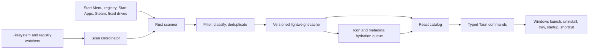

# Windows Apps Technical Documentation

Technical reference for Windows Apps `0.2.7`.

[README](README.md) ·
[Release 0.2.7](https://github.com/keskiyo/WindowsApps/releases/tag/v0.2.7) ·
[Telegram](https://t.me/keskiyo)

---

## 1. Product scope

Windows Apps is a local Windows application catalog, launcher, and organization layer. It discovers applications from Windows and local-drive sources, sanitizes and deduplicates the results, stores a lightweight cache, and exposes native launch and registered-uninstall operations through a React interface.

The supported product scope does not include:

- cloud synchronization;
- telemetry or software-inventory uploads;
- online metadata enrichment;
- arbitrary command execution from the frontend;
- VPN control;
- direct deletion of program directories.

The application updates itself from signed GitHub Releases (see §12). It never
auto-updates the third-party applications it catalogs.

## 2. Supported environment

| Component        | Current implementation                       |
| ---------------- | -------------------------------------------- |
| Operating system | Windows 10 and Windows 11                    |
| CPU architecture | x64                                          |
| Desktop runtime  | Tauri 2 and Microsoft Edge WebView2          |
| Frontend         | React 18, TypeScript, Vite 6, Tailwind CSS 4 |
| Native backend   | Rust 2021 and Windows APIs                   |
| State            | Zustand plus local component state           |
| Tests            | Vitest/Testing Library and Rust unit tests   |
| Package target   | NSIS setup executable                        |

The main window uses custom decorations, supports resizing, and has a minimum size of `560 × 520`. At minimum width, application grids retain two columns and the header keeps navigation, search, and Refresh on one row while hiding the application identity. The catalog summary cards navigate directly to All applications, Favorites, Hidden, and Auxiliary tools.

## 3. Architecture


```mermaid
flowchart LR
  Sources["Start Menu, registry, Start Apps, Steam, fixed drives"] --> Scanner["Rust scanner"]
  Watchers["Filesystem and registry watchers"] --> Coordinator["Scan coordinator"]
  Coordinator --> Scanner
  Scanner --> Clean["Filter, classify, deduplicate"]
  Clean --> Cache["Versioned lightweight cache"]
  Cache --> UI["React catalog"]
  Cache --> Hydration["Icon and metadata hydration queue"]
  Hydration --> UI
  UI --> IPC["Typed Tauri commands"]
  IPC --> Native["Windows launch, uninstall, tray, startup, shortcut"]
```

### Ownership boundaries

The React frontend owns:

- presentation and responsive navigation;
- search and current view state;
- Favorites, Hidden items, custom categories, and manual category assignments;
- dialogs, confirmations, scan progress, and user feedback.

The Rust backend owns:

- discovery and portable scanning;
- cache persistence and incremental indexes;
- icon and executable metadata extraction;
- deduplication inputs and source-aware launch targets;
- uninstall target resolution and execution;
- global shortcut, autostart, tray, and window lifecycle;
- filesystem and registry watchers.

The frontend sends application IDs for native actions. Rust resolves those IDs through trusted maps built from the catalog, so the webview cannot supply an arbitrary executable path.
Raw registry access and Windows handles are owned by `src-tauri/src/platform/windows/`; catalog and command modules consume typed platform results.

## 4. Tauri command surface

| Command                   | Responsibility                                                               |
| ------------------------- | ---------------------------------------------------------------------------- |
| `get_apps`                | Return the sanitized cached catalog, cache status, and generation.           |
| `refresh_apps`            | Run an interactive incremental refresh.                                      |
| `force_full_scan`         | Rebuild configured sources without relying on the previous filesystem index. |
| `reset_catalog_cache`     | Remove generated catalog and icon caches, then run a clean full scan.        |
| `clear_icon_cache`        | Remove only generated icons; keep the catalog and filesystem index.          |
| `hydrate_visible_icons`   | Promote visible application IDs in the hydration queue.                      |
| `start_background_sync`   | Start background validation after the cached catalog is displayed.           |
| `cancel_scan`             | Cancel active and queued scanning work.                                      |
| `launch_app`              | Launch a trusted catalog entry by ID.                                        |
| `get_uninstall_preview`   | Return application identity, publisher, source, and safe removal mechanism.  |
| `uninstall_app`           | Execute the trusted uninstall target and record its result.                  |
| `get_uninstall_history`   | Return the local uninstall history newest-first.                             |
| `clear_uninstall_history` | Delete uninstall history without modifying applications.                     |
| `get_system_settings`     | Return version, autostart, shortcut, scan settings, and fixed drives.        |
| `set_autostart`           | Enable or disable startup for the current Windows account.                   |
| `set_scan_settings`       | Save automatic fixed-drive, included-path, and excluded-path settings.       |
| `open_telegram`           | Open the fixed project contact URL.                                          |
| `open_github`             | Open the fixed project repository URL.                                       |
| `open_release`            | Open the GitHub release-notes page for a validated version string.           |
| `stale_copy_status`       | Report when this process is an outdated leftover copy of a newer install.    |
| `open_installed_copy`     | Launch the newer registered installed copy and exit this outdated one.       |

## 5. Catalog discovery

### Sources

The catalog combines:

- per-user and system Start Menu shortcuts;
- uninstall registry entries for 64-bit, 32-bit, and current-user software;
- Windows Start Apps and packaged applications;
- Steam library folders and app manifests;
- portable executables discovered on fixed local drives;
- user-configured included folders.

Drive letters and user folder names are not hardcoded.

### Exclusions

Automatic portable discovery excludes:

- removable USB drives;
- network and optical drives;
- junctions, symbolic links, and other reparse-point directories;
- configured excluded paths;
- dependency, cache, system, and maintenance locations;
- Python virtual environments and package trees (`.venv`, `venv`, `env`, `site-packages`);
- driver-installer staging trees (`Chipset_Software`) and InstallShield prerequisite payload (`ISSetupPrerequisites`);
- installers, uninstallers, updaters, crash reporters, helper binaries, and documentation shortcuts.

Entries whose launch target no longer exists on a mounted drive are dropped (a Start-Menu shortcut left behind by an uninstalled application). A target on a currently-unmounted drive is kept, so unplugging a removable or second disk does not erase its apps.

### Scan limits

Default limits for each portable scan root:

| Limit            | Value          |
| ---------------- | -------------- |
| Maximum depth    | 16 directories |
| Maximum entries  | 500,000        |
| Maximum duration | 3 minutes      |

If an entry or time limit is reached, discovered results are retained but the partial directory is not recorded as fully indexed. A later scan can inspect it again.

## 6. Startup, incremental scanning, and watchers

1. `get_apps` reads the versioned cache and renders application names immediately.
2. A missing cache produces the first-scan prompt instead of silently scanning all drives.
3. Cached applications enter a background hydration queue for icons and local metadata.
4. `start_background_sync` checks Windows sources and indexed fixed-drive directories without blocking startup.
5. Unchanged directories reuse cached application records.
6. Changed directories are re-enumerated and their additions/removals are merged into a new catalog generation.
7. Watcher-triggered scans emit deltas instead of replacing the entire frontend list.
8. Interactive Refresh and Force full scan return a complete list and expose progress.

One scan coordinator serializes Startup, Watch, Refresh, and Force work:

- repeated watcher events are coalesced;
- interactive work cancels lower-priority background work;
- cancelled results are not written to the cache;
- only one scan mutates the catalog at a time.

The watcher monitors Start Menu paths, uninstall registry keys, and user-configured included folders. Arbitrary fixed-drive roots are validated during startup or Refresh instead of being watched recursively.

## 7. Cache and asynchronous hydration

The catalog cache contains lightweight application records and a monotonically increasing generation. Large icon payloads are stored separately.

Icon hydration:

- deduplicates requests by application ID and catalog generation;
- promotes currently visible cards;
- processes only changed applications after watcher scans;
- emits patches in batches of 24 to avoid a full React update for every icon;
- uses source fingerprints to reuse valid cached PNG data;
- discards stale work after a new generation starts.

Reset catalog cache removes generated catalog/index and icon cache files. It does not remove Favorites, Hidden entries, custom categories, category ordering, or manual assignments.

Settings also exposes two narrower operations. **Repair missing icons** queues only applications currently missing an icon. **Clear icon cache** removes the standalone icon cache and queues extraction from the existing catalog. Neither operation enumerates drives or invalidates the incremental filesystem index.

Every successful synchronization stores privacy-safe diagnostics with the catalog: completion time, elapsed milliseconds, scan mode, application total, source totals, and added/updated/removed counts. Paths and usernames are not included.

## 8. Filtering and duplicate resolution

Discovery and visibility are separate stages. Every retained candidate receives a `primary`, `auxiliary`, or `rejected` classification with a numeric score and stable reason codes. AUMID, Start Menu, Steam, registered uninstall products, coherent PE metadata, runtime paths, and component-role markers contribute independent evidence.

Normal categories, search, Favorites, and command surfaces exclude `auxiliary` entries. The **Auxiliary tools** view keeps uncertain runtime and maintenance components inspectable. A user can restore an entry to the main catalog; its canonical identity is persisted in local preferences and survives incremental refresh, full scan, and cache reset.

Beyond product components, two further classes are auxiliary. **Command environments** open a configured interpreter shell rather than an application: a shortcut whose target is a generic host (`cmd`, `powershell`, `pwsh`, `rundll32`, `python`/`pythonw`, `mysql`, `node`, `wsl`, `wscript`/`cscript`) carrying arguments, or a named developer prompt (Visual Studio Developer/Native Tools/Cross Tools command prompt, Python IDLE, a database command-line client, a Node.js tools installer). A plain interpreter with no arguments (`Windows PowerShell`, `Command Prompt`) stays primary. **Diagnostic launchers** — a "safe mode" / "reset preferences and cache" variant — are auxiliary or rejected. Oracle Java runtime entries are auxiliary. A command-environment or product-component classification is sticky: it survives a merge, so an AUMID sibling that is primary only by the launch-kind fast-path cannot promote the merged card back into the main catalog.

User visibility overrides now prefer a separate hashed canonical identity. AUMID and Steam identities are strongest; normalized ProductName, publisher, and install root provide cross-source stability; resolved target and normalized path are conservative fallbacks. Legacy promoted IDs remain as fallback and are migrated when a current catalog entry can be matched. Portable roots remain part of identity, so copies at a different (or unknown) version do not collapse; copies at the same exact version are merged.

The model retains PE `ProductName` and `OriginalFilename`, plus shortcut arguments. OriginalFilename contributes installer/helper evidence but is never sufficient by itself to reject a normal registered product. Only known user-facing shortcut modes (`--profile-directory`, `--user-data-dir`, `--app`, `--app-id`, `--class`, Firefox `-p`) split target identity.

Debug builds write `%LOCALAPPDATA%\WindowsApps\visibility-report.json` for rejected candidates. User-profile prefixes are replaced with `<USERPROFILE>` and the report is not emitted as a normal production log. A small synthetic fixture corpus lives under `src-tauri/tests/fixtures`; it validates the runner and regression examples but is not evidence of real-world accuracy.

Definite installers, uninstallers, documentation shortcuts, broken resource names, and maintenance executables are rejected. Ambiguous executable names are not rejected solely by name. Registry records marked `SystemComponent=1` remain metadata-only and cannot create a launch card.

Deduplication is **order-independent and idempotent**: the input is canonicalized (by candidate quality, then path) before resolution, so the same catalog produces the same groups regardless of the order the scanners emitted entries, and re-running changes nothing. This is what keeps the frontend delta path from accumulating a less-merged variant across background syncs.

Duplicate matching considers:

- case-insensitive paths;
- resolved shortcut targets — except a **generic interpreter host** (`cmd`, `powershell`, `rundll32`, `python`, …), which is not an identifying target, so distinct tools that merely share an interpreter (a Node.js prompt and a VS command prompt) neither collide on one identity nor over-merge;
- normalized product families;
- architecture markers anywhere in the name — `x86`, `x64`, `x86_x64`, `(x86)`/`(x64)`, `WOW`/`WOW64`, `32-bit`/`64-bit` — treated as noise, so the 32-bit and 64-bit builds of one tool collapse to a single card that keeps the 64-bit build;
- version suffixes;
- exact version: two copies of the same product at the same version merge across install roots (a portable copy beside its installed shortcut, or the same portable in two folders) — a **different** version is treated as a different program and stays separate;
- shortcut/executable pairs in the same product folder;
- package and desktop identity;
- publishers when both are available.

Candidate priority is:

1. Steam identity;
2. `.lnk` shortcut;
3. `.exe` executable;
4. packaged application identity.

On a merge the entry surfaced is the higher-priority one, preferring the 64-bit build when two differ only by architecture. Metadata and uninstall data from the secondary record are merged into the preferred record when safe. Conflicting publishers and products that merely share a prefix remain separate. Deduplication intentionally prefers a possible duplicate over hiding a legitimate application when identity evidence is weak.

## 9. Categories and navigation

Built-in categories:

- Games;
- AI & Agents;
- Editors & Design;
- Development;
- Browsers;
- Media;
- Communication;
- Utilities;
- System;
- Windows Features;
- Other.

Category assignment runs after deduplication on the merged record and weighs several signals, not the name alone: the Steam source and a game-store install path (`\steamapps\`, `\Battle.net\`, `\Epic Games\`, …) or an unambiguous game publisher (Blizzard, Valve, Riot, …) map to Games; a few distinctive publishers pin a category (Adobe/Blackmagic → Editors, JetBrains → Development); everything else falls back to curated keyword lists over the name **and the resolved target executable** (so a neutrally named shortcut to `SotaVPN.exe` still reads as a VPN → Utilities), including VPN/proxy clients and database tools. A user override always wins.

Windows Features is based on known names, targets, and package identities. A generic Microsoft publisher/name is not enough to classify an application as a Windows component.

Users can:

- create, rename, delete, and reorder categories;
- drag a category by its name;
- click the same category row to navigate to it;
- move applications between categories;
- mark applications as Favorites;
- hide and later restore applications.

Deleting a custom category moves its applications to Other. Hidden is a separate navigation view and does not uninstall or modify the application.

At widths of `1024px` and above, navigation uses a persistent sidebar. Below `1024px`, the same navigation is presented as an overlay drawer.

Frontend preferences use schema version 4. Reads tolerate any earlier shape — missing or unfamiliar fields are defaulted rather than migrated per version — preserve unknown root fields, recover from the previous valid backup when the primary document is malformed, and refuse to overwrite a document written by a newer version.

## 10. Launching

Launch kinds:

- executable;
- shortcut;
- AppUserModelID / packaged application;
- Steam-managed application identity.

The backend stores each trusted launch kind and target against its stable application ID. `launch_app` accepts only that ID and resolves the actual target inside Rust.
Input-idle wait capacity belongs to `AppState`, so each application runtime owns and releases its bounded process-handle permits independently.

## 11. Uninstalling

Supported uninstall targets:

1. registered quiet vendor command when available;
2. registered standard vendor or MSI command;
3. valid MSIX package removal.

Before confirmation, the UI requests an uninstall preview containing:

- application name;
- publisher;
- catalog source;
- safe removal-mechanism label.

Executable paths, arguments, package identities, registry keys, and command lines remain backend-only.

If Rust cannot resolve a concrete safe target, the action remains disabled as **Uninstall unavailable**.

Safety rules:

- UNC/network-hosted uninstall executables are rejected;
- empty or malformed registered commands are rejected;
- program directories are not deleted directly;
- deleting a shortcut is not treated as uninstalling software;
- the frontend cannot substitute a command or target path.

The history stores only:

- timestamp;
- application name;
- publisher;
- removal mechanism;
- succeeded/failed result.

It retains the newest 100 records and excludes command text, paths, arguments, package IDs, usernames, and detailed errors.

## 12. Native Windows integrations

### System tray

Closing the main window hides it instead of terminating the process. The tray icon can restore the window. **Quit** performs an intentional process exit.

### Global shortcut

`Win+Shift+Q` is registered with `RegisterHotKey` and physical `VK_Q`. It therefore refers to the same keyboard key when the active layout changes.

If another process owns the combination, the application remains usable and Settings reports the registration error.

### Startup

The startup toggle writes the quoted current executable path to:

```text
HKCU\Software\Microsoft\Windows\CurrentVersion\Run
```

The setting applies only to the current Windows account.

### WebView2

Production bundles use Tauri's silent WebView2 download bootstrapper when the runtime is missing.

### Automatic updates

On startup the app checks the updater endpoint for a newer signed release:

```text
https://github.com/keskiyo/WindowsApps/releases/latest/download/latest.json
```

- Updates are verified against the public key embedded in `tauri.conf.json`; an unsigned or
  mismatched package is rejected.
- If an update is available the UI shows a fixed-size modal with version, release date,
  package size, highlights, and a link to the complete GitHub release notes.
  The user chooses when to download and restart — updates are never forced.
- Progress follows Downloading, Verifying, Finishing update, and Restarting. Downloading reports
  real bytes and percentage; later stages are indeterminate because Tauri does not expose
  internal installer percentages. Windows `quiet` mode hides the separate NSIS progress
  window and requires a user-writable install location. A failed update remains in the dialog
  with a safe explanation and a Retry update action.
- The check is silent when offline, when no newer release exists, or when running outside
  the desktop app (development browser and tests).
- The private signing key lives outside the repository and is provided to CI through the
  `TAURI_SIGNING_PRIVATE_KEY` secret; it is never committed.

### Launch feedback

`launch_app` starts the process through the Windows shell, which returns before the target
window is ready. When a process handle is available the backend waits for input-idle and
emits a `launch://status` event so the launching card clears early; otherwise a short
client-side ceiling clears it. A top activity bar reflects any in-flight launch or scan.

## 13. Privacy and security

- Catalog discovery and categorization are local.
- No external telemetry or catalog upload is configured.
- No online application-description lookup is performed.
- The Content Security Policy allows application resources and Tauri IPC endpoints.
- Native launch and uninstall operations resolve trusted Rust-owned catalog records.
- Uninstall actions require explicit confirmation.
- Scan recursion is bounded and does not follow reparse points.
- Debug logging is enabled only in debug builds.
- The release installer is unsigned and can trigger SmartScreen.

## 14. Repository structure

```text
public/                          Static assets and application icon
src/components/apps/             Application cards and action menus
src/components/catalog/          Catalog grids and sortable sections
src/components/dialogs/          App information and destructive confirmations
src/components/navigation/       Sidebar, drawer, and category navigation
src/components/settings/         Settings and uninstall history
src/components/shared/           Header, title bar, scan prompt, shared UI
src/hooks/                       Navigation, spotlight, and scroll-lock hooks
src/lib/                         Tauri clients, preferences, catalog utilities
src/store/                       Zustand application state
src/types/                       Shared TypeScript contracts
src-tauri/src/app_state.rs       Process-wide trusted catalog target state
src-tauri/src/catalog_sync.rs    Scan, cache, watcher, and hydration orchestration
src-tauri/src/commands.rs        Tauri IPC transport handlers
src-tauri/src/catalog/           Discovery, cache, scanning, hydration, deduplication
src-tauri/src/lifecycle/         Tray and window lifecycle
src-tauri/src/platform/windows/  Windows-specific native integrations
tests/frontend/                  Frontend tests, mirroring src/ layout by layer
.github/workflows/release.yml    Tag-driven Windows release pipeline
scripts/                         Release version/source/asset checks, manifest prep, boundary verifiers
```

A component that holds a private subcomponent or local static data lives in its own folder
`components/<layer>/<ComponentName>/`: the main component in `<ComponentName>.tsx`, each private
subcomponent in its own file, local types in `types.ts`, and static data or item-builders in
`data.ts`. No `index.ts` barrels — components are imported by their explicit file path. Single-file
components stay flat. Reference: `components/shared/WorkspaceSummary/`.

## 15. Development workflow

The supported toolchain, local development commands, verification commands, and bundle path are maintained in [README.md](README.md#development).

## 16. Release automation

`.github/workflows/release.yml` runs when a `v*` tag is pushed.

The workflow:

1. checks out the tag with full history and rejects its commit unless it is reachable from `origin/master`;
2. configures Node.js 22 and stable Rust;
3. runs `npm ci`;
4. validates the tag against npm and Cargo manifests, both lockfiles, and `src-tauri/tauri.conf.json`;
5. runs frontend lint, type-checking, tests, and the production build;
6. runs Rust tests, formatting, and Clippy with warnings denied;
7. runs `tauri-apps/tauri-action`, which builds and signs the NSIS bundle in a draft release;
8. asks GitHub to generate release notes from commit history and applies them to the draft;
9. creates `latest.json` from the signed local NSIS bundle and adds the package size and release URL;
10. verifies the manifest, installer, signature, date, size, URL, and target agreement, then publishes the release.

Release automation depends only on tracked workflow, configuration, and verification scripts. Local planning and release instruction files are not used by CI or stored in the repository.

## 17. Troubleshooting

### Catalog is empty

Select **Scan for apps**. The first complete scan requires explicit user action.

### Duplicate or stale entries remain

Run Refresh first. If the saved cache already contains bad records, use **Settings → Catalog maintenance → Reset catalog cache**.

### Application is missing

Confirm that it is on a permanent local drive and not under an excluded folder. Add its folder under **Settings → Application discovery** if needed. Executables without usable metadata may be rejected unless their filename/folder identify a real portable product.

### Icon is missing

Keep the application visible briefly so its ID receives hydration priority. Refresh if its shortcut or executable changed. Some Windows shell entries do not expose an extractable icon.

### Global shortcut does not work

Confirm Windows Apps is still running in the notification area. Check the shortcut status in Settings; another process may already own `Win+Shift+Q`.

### Startup does not work

Disable and enable **Launch when Windows starts** again, especially if the executable was moved after the setting was created.

### Uninstall is unavailable

Windows did not expose a valid registered vendor, MSI, or MSIX uninstall target for that catalog entry. Windows Apps intentionally does not guess a command or delete its directory.

### SmartScreen warning

The installer is not Authenticode-signed. Download it only from the official project Releases. After the first install, updates are delivered as cryptographically signed packages that the app verifies against its embedded public key before installing.

## 18. Release verification

Run the complete verification commands in [README.md](README.md#development), then run the tracked release scripts for version consistency, source ancestry, manifest preparation, and asset validation. Publication still requires the Windows updater smoke test and the exact asset checks described by the release workflow.

---

[README](README.md) ·
[Release 0.2.7](https://github.com/keskiyo/WindowsApps/releases/tag/v0.2.7) ·
[Telegram: @keskiyo](https://t.me/keskiyo)
