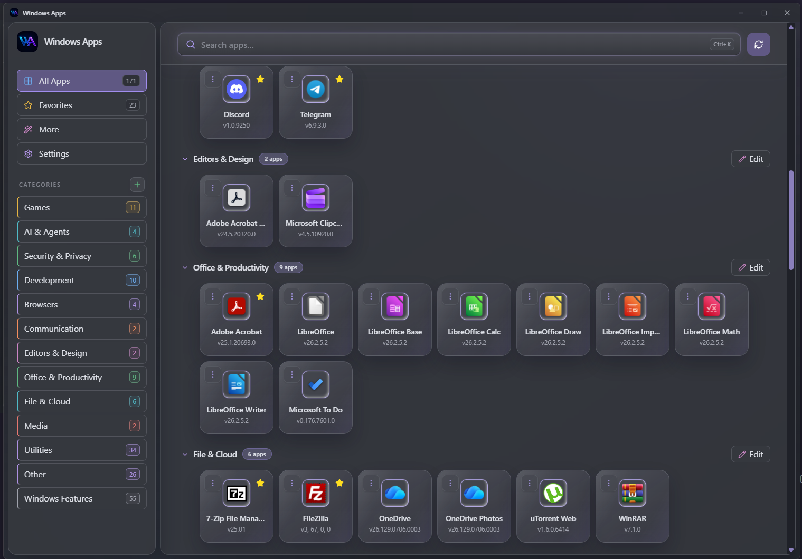
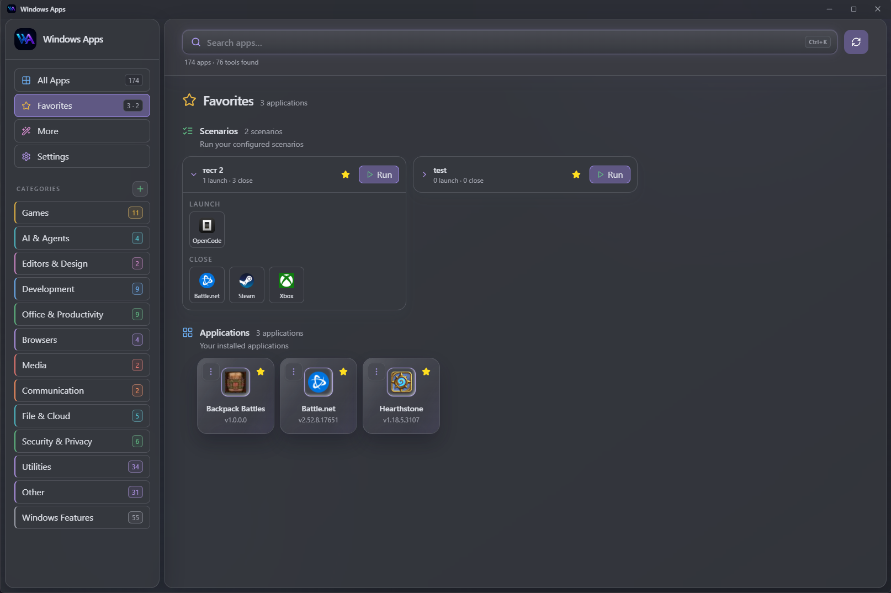
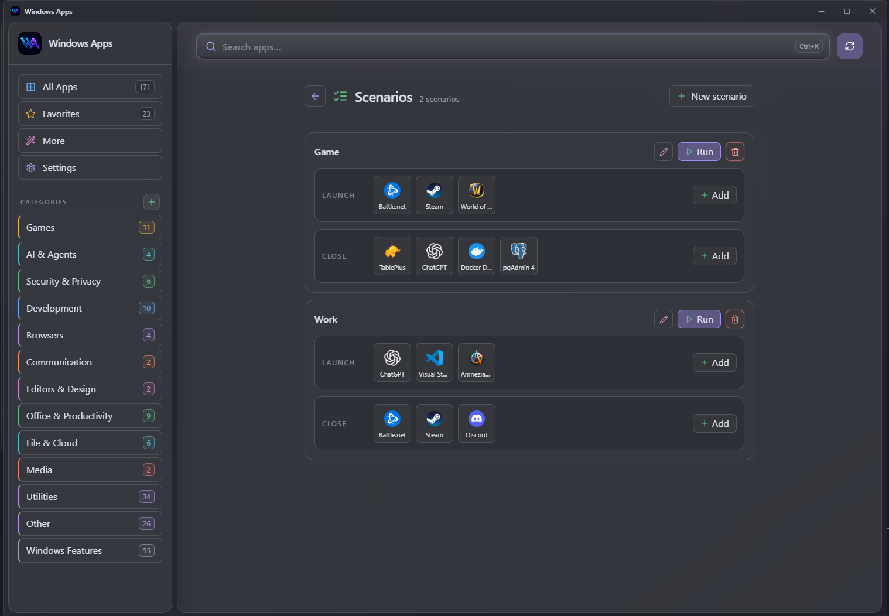
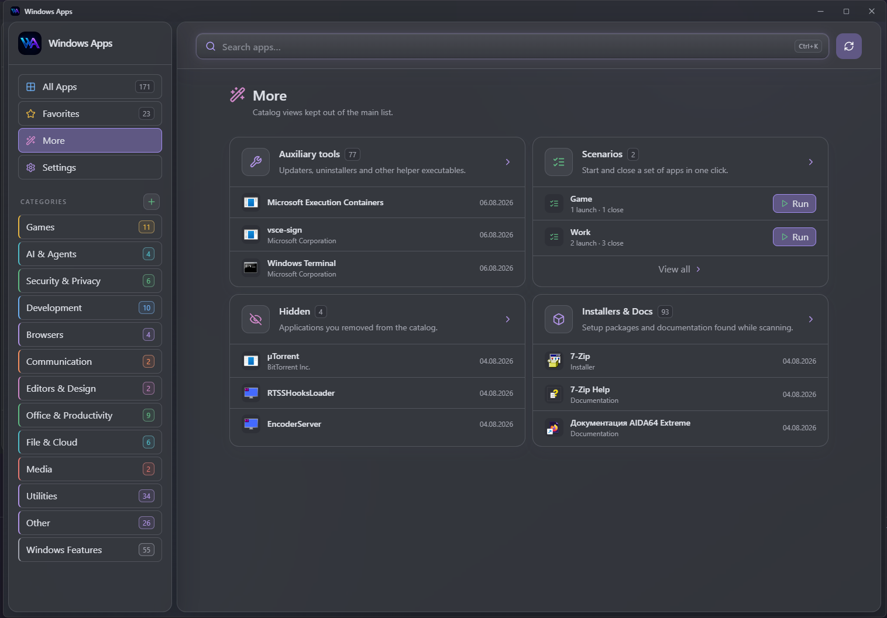
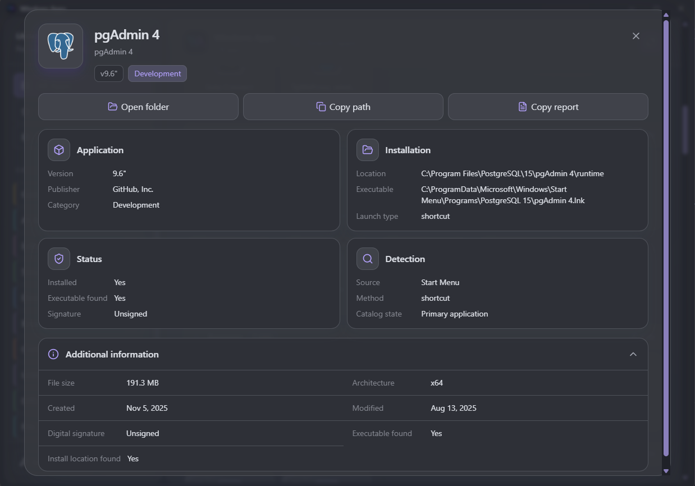
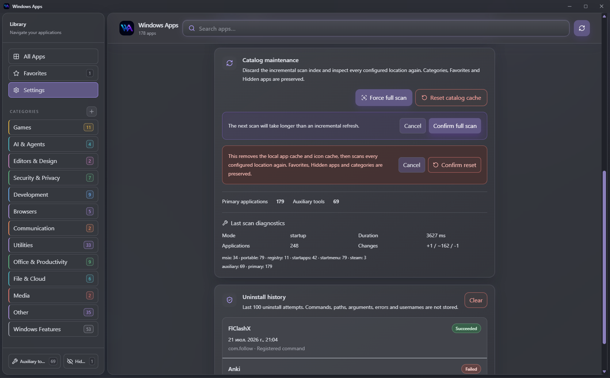

<p align="center">
  
</p>

<h1 align="center">Windows Apps</h1>

<p align="center">A local catalog for the Windows software you already use.</p>

<p align="center">
  Windows Apps finds Start Menu shortcuts, installed desktop programs, Microsoft Store apps, Steam games and portable executables.<br>
  It brings them together in one searchable catalog and merges duplicate entries into a single application card.
</p>

<p align="center">
  <a href="https://github.com/keskiyo/WindowsApps/releases/tag/v0.3.5"></a>
  
  
  
  
</p>

<h2 align="center"><a href="https://github.com/keskiyo/WindowsApps/releases/latest">⬇ Download Windows Apps</a></h2>

<p align="center">Windows 10/11 · x64 · Local-first</p>



## One catalog for Windows software

Windows keeps applications in several places. Windows Apps combines:

- Start Menu shortcuts
- installed desktop programs
- Microsoft Store apps
- Steam games
- portable executables in folders you choose

When the same application is discovered from more than one source, it appears once rather than as a collection of duplicates.

## From discovery to launch

1. **Discover** Windows software, Steam games and selected portable-app folders.
2. **Organize** the catalog with categories, Favorites, Auxiliary tools and Scenarios.
3. **Launch** applications through their native Windows, Steam or executable path.

## Built for everyday use

### Search the catalog

Find applications by name, publisher, description or path, including typo-tolerant search.
Typing a name in Russian letters finds the Latin one, and when a match sits in another
section the results say so and link straight to it.

### Keep one card per application

Shortcuts, registry entries, Store packages and other representations of the same program are merged into one card.

### Launch through the right system path

Steam games open through Steam, packaged apps through Windows and executables directly.

### Save useful setups

Favorites, categories and Scenarios let you keep common applications and launch-and-close setups close at hand.

## Favorites and Scenarios



Star applications for quick access, or run a Scenario that opens one group of applications and closes another.

## Scenario details



Each Scenario shows the applications it will launch and the applications it will close before you run it.
If an application later disappears from Windows, its saved name and icon remain visible as
**Unavailable** so it can be removed without deleting the whole Scenario.

## More catalog views



Auxiliary tools, hidden applications, installers and documentation stay available without crowding the main catalog.

## Application details



Inspect local file details, architecture, signature status and installation state for an application card.

## Settings and maintenance



Everyday settings stay visible. Scanning, backups and maintenance live under Advanced. Settings
export contains preferences only, and import reports an error if Windows Apps cannot persist the
restored data. When Windows startup is enabled, Windows Apps starts in the system tray; choose
**Open Windows Apps** from the tray menu when you need the window.

## Install

1. Download [**`Windows.Apps_0.3.5_x64-setup.exe`**](https://github.com/keskiyo/WindowsApps/releases/latest).
2. Run the installer.
3. Start Windows Apps and choose **Scan for apps**.

> [!WARNING]
> The installer is not Authenticode-signed, so SmartScreen may show **Windows protected your PC**. Choose **More info → Run anyway** and download only from this repository's Releases.

| Requirement  | Value                           |
| ------------ | ------------------------------- |
| OS           | Windows 10 or 11                |
| Architecture | x64                             |
| Runtime      | Microsoft Edge WebView2         |
| Internet     | Not required after installation |
| Account      | Not required                    |

## Privacy

Windows Apps is local-first. It has no telemetry, cloud account, application-inventory uploads or online metadata enrichment; catalog data remains on your machine.

For implementation and security details, see [Technical Documentation](Documentation.md#13-privacy-and-security). Windows Apps is available under the [MIT License](LICENSE).

## Known limitations

- Windows 10/11 and x64 only.
- The installer is not Authenticode-signed; SmartScreen may appear.
- Microsoft Edge WebView2 is required.

## Development

Prerequisites: Node.js 22, Rust 1.88+ with the MSVC toolchain, Microsoft C++ Build Tools, Windows SDK and the [Tauri Windows prerequisites](https://v2.tauri.app/start/prerequisites/).

```powershell
npm install
npm run tauri dev
```

See [Technical Documentation](Documentation.md#16-verification-and-releases) for verification and release commands.

## Contributing

Bug reports and pull requests are welcome. Read [Technical Documentation](Documentation.md) before changing code or workflows.

## Links

[Documentation](Documentation.md) · [Releases](https://github.com/keskiyo/WindowsApps/releases) · [Telegram: @keskiyo](https://t.me/keskiyo)
