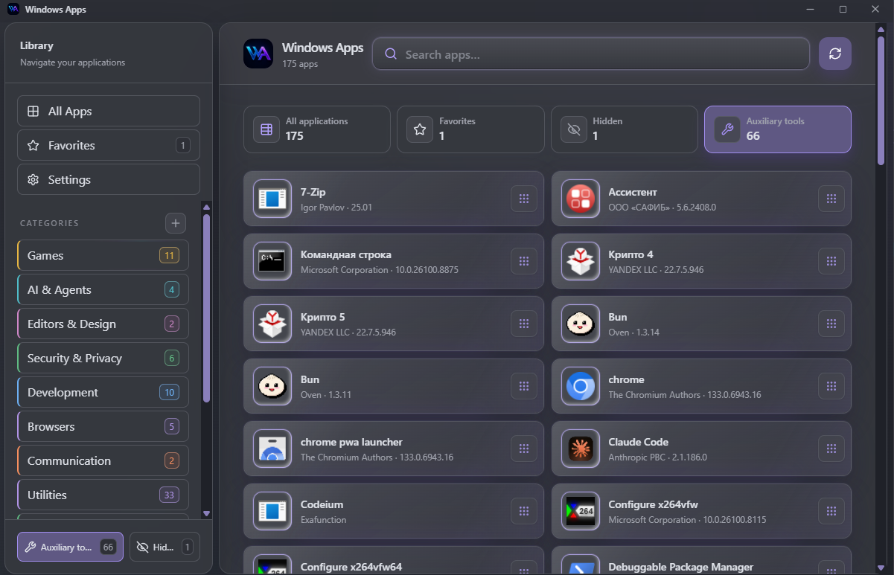

<div align="center">
  

# Windows Apps

**Every application on your PC, in one searchable place.**

Start Menu shortcuts, installed programs, Store apps, Steam games and portable executables — collected into a single catalog that opens instantly and stays on your machine.

[](https://github.com/keskiyo/WindowsApps/releases/tag/v0.2.8)


### [⬇ Download for Windows](https://github.com/keskiyo/WindowsApps/releases/latest)

[Documentation](Documentation.md) · [Release notes](https://github.com/keskiyo/WindowsApps/releases/tag/v0.2.8) · [Telegram](https://t.me/keskiyo)


</div>

---

## Contents

[Why](#why) · [Screenshots](#screenshots) · [Install](#install) · [Features](#features) · [Scanning](#scanning) · [Privacy](#privacy) · [Development](#development)

## Why

Windows spreads your software across four places that never agree with each other: the Start Menu, Installed apps, the Microsoft Store, and whatever you unzipped to a folder. Windows Apps reads all of them and produces one list.

The interesting part is what happens next. The same program found as a shortcut, a registry entry, a Store package and a Steam game becomes **one card**. Runtime components, updaters and language servers step aside into **Auxiliary tools** instead of cluttering your categories. And your favorites and custom categories follow the application itself, so a rescan or a version bump does not scatter them.

Everything runs locally. Nothing about your machine is uploaded.

## Screenshots

<div align="center">
  
</div>

**Auxiliary tools** is where the catalog puts what it is not sure about — CLI executables, browser
components, bundled helpers. They stay out of your categories and out of search, but nothing is
deleted and any of them is one click from returning to the main catalog. The tiles across the top
count each view, and every count matches the list it opens.

## Install

1. Download **`Windows.Apps_0.2.8_x64-setup.exe`** from the [latest release](https://github.com/keskiyo/WindowsApps/releases/latest).
2. Run it.
3. Start **Windows Apps** and choose **Scan for apps**.

> The installer is not Authenticode-signed, so SmartScreen may show _"Windows protected your PC"_. Choose **More info → Run anyway**. Download only from this repository's Releases. Automatic updates are cryptographically signed and verified by the app before installing.

| Requirement  | Value                      |
| ------------ | -------------------------- |
| OS           | Windows 10 or 11           |
| Architecture | x64                        |
| Runtime      | Microsoft Edge WebView2    |
| Internet     | Not required after install |

## Features

### Finding and launching

- **Search that forgives** — matches name, publisher, description and path; tolerates typos and finds apps even when you type in the wrong keyboard layout.
- **Quick-launch palette** — `Ctrl+K` from anywhere, `Ctrl+F` or `/` to jump to search.
- **Launches the way Windows intends** — shortcuts, executables, packaged apps and Steam entries each use their native mechanism, so Steam overlay, cloud saves and playtime keep working.
- **Honest feedback** — the card stays busy until the app's window is actually ready, not just until the process spawned.

### A catalog that thinks

- **One card per application** — merging weighs resolved targets, product families, publishers and install roots. Ambiguous cases are kept, not guessed away.
- **Auxiliary instead of deletion** — runtime components and maintenance executables leave your categories but stay inspectable, and any of them is one click from coming back.
- **Explainable decisions** — every entry carries a visibility score and stable reason codes; `ServiceDesk` is not mistaken for a service.
- **Choices that survive** — Favorites, Hidden items and category assignments are tracked by application identity, so they follow the app through a rescan, a version change or a cache reset.

### App information

Open any card's details for file size and dates, CPU architecture, Authenticode signature status, and whether the install location still exists — with copy-path, copy-report and **Open folder** actions. Read locally, resolved from a catalog ID.

### Fast by design

- Cache-first startup: names render before any scan runs, icons stream in behind them.
- Incremental scanning re-reads only what changed on disk.
- Full scans are bounded and cancellable, with live progress.
- Cards mount in batches while you scroll, so a large catalog stays smooth.

### Fits the desktop

- Lives in the tray; `Win+Shift+Q` brings it back, on any keyboard layout.
- Custom categories, drag-to-move, Favorites first, reversible Hidden items.
- Uninstall through Windows' own registration — vendor, MSI or MSIX.
- Signed automatic updates with full notes and byte progress. Nothing is forced.
- Focus-trapped dialogs, arrow-key menus, reduced-motion support, and a sidebar that becomes a drawer on narrow windows.

## Scanning

Windows Apps scans permanent local drives. Removable, optical and network drives are excluded.

Each scan root is limited to **16 directory levels**, **500,000 entries** and **three minutes**. Symbolic links and junctions are skipped, so a scan can neither loop nor run away.

| Action                   | What it does                                   |
| ------------------------ | ---------------------------------------------- |
| **Refresh**              | Normal incremental update                      |
| **Force full scan**      | Rebuild the filesystem index                   |
| **Repair missing icons** | Retry extraction only where an icon is missing |
| **Clear icon cache**     | Rebuild icons without rescanning drives        |
| **Reset catalog cache**  | Remove generated caches and scan clean         |

Favorites, Hidden items, promoted tools, custom categories and assignments survive all of these.

Visibility is conservative. Dropping an entry entirely cannot be undone from the interface, so it takes more than a suggestive name: an application Windows registered as a real product is kept even when its name reads like an installer. Shared runtimes and redistributables are matched separately and always dropped. Anything merely uncertain lands in **Auxiliary tools**, where **Restore to catalog** makes a permanent override.

## Privacy

- The catalog is built and stored **on your machine**.
- No inventory, drive list or telemetry is uploaded. No telemetry service exists.
- Missing metadata is left unknown — nothing is invented or fetched.
- The interface can only pass an **ID**; every launch and uninstall target is resolved inside Rust, never from a path the window supplied.
- Processes are built from a fixed executable plus an argument vector — never a shell string. Network targets and unvalidated uninstall commands are refused.
- Program folders are never recursively deleted as an uninstall method.
- Uninstall history keeps the newest 100 attempts with only name, publisher, mechanism and result — no command, path, argument or error text.

See [Documentation.md](Documentation.md#13-privacy-and-security) for the full security model.

## Development

Prerequisites: Node.js 22, Rust 1.88+ with the MSVC toolchain, Microsoft C++ Build Tools and Windows SDK, WebView2 Runtime, and the [Tauri Windows prerequisites](https://v2.tauri.app/start/prerequisites/).

```powershell
npm install
npm run tauri dev
```

Verification — all of these must pass:

```powershell
npm run lint
npm run typecheck
npm test
npm run build
cargo test --manifest-path src-tauri/Cargo.toml
cargo fmt --manifest-path src-tauri/Cargo.toml --check
cargo clippy --manifest-path src-tauri/Cargo.toml --all-targets -- -D warnings
```

Coverage is reported, not gated (`npm run test:coverage`). The MSRV declared in `src-tauri/Cargo.toml` is a compatibility promise and is compiled by the MSRV job in `.github/workflows/verify.yml`.

Production build:

```powershell
npm run tauri build
```

Local artifact: `src-tauri/target/release/bundle/nsis/Windows Apps_0.2.8_x64-setup.exe`

## Support

[Technical documentation](Documentation.md) · [Releases](https://github.com/keskiyo/WindowsApps/releases) · [Telegram: @keskiyo](https://t.me/keskiyo)

<div align="center">
  <sub>Built with Tauri, Rust, React, TypeScript, Vite and native Windows APIs.</sub>
</div>
